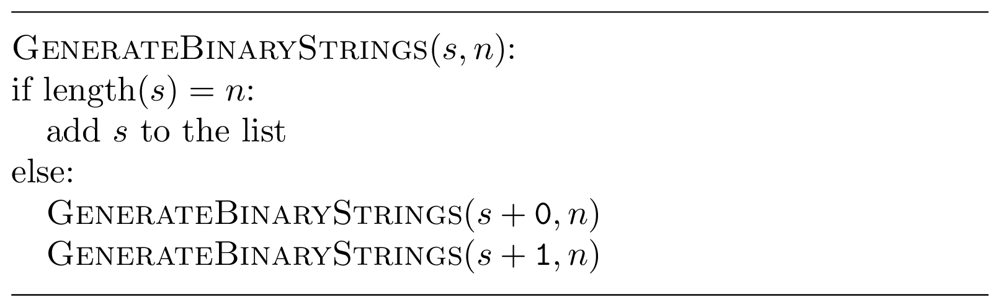

### Solution

Let's take a look at the list of all binary strings of length 3 sorted in the
lexicographic order:
 * ${\tt 000}$
 * ${\tt 001}$
 * ${\tt 010}$
 * ${\tt 011}$
 * ${\tt 100}$
 * ${\tt 101}$
 * ${\tt 110}$
 * ${\tt 111}$

Thus, we first need to generate four strings starting with 0 and 
then generate four strings starting with 1. This can be done recursively:
start with an empty string $s$; within each recursive call, first append 
${\tt 0}$ to $s$ and proceed recursively, then append ${\tt 1}$ to $s$
and proceed recursively. The call to $\operatorname{GenerateBinaryStrings}(s, n)$
for an empty string $s$ populates the list with all binary strings of length $n$.

Another (though similar) way to generate all binary strings is based on the 
following observation: by cutting the first symbol out of the first four strings
of length three, one gets all binary strings of length two, in the lexicographic
order (and the same holds for the last four strings). This leads to the 
following recursive algorithm: generate all binary strings of length $n-1$;
then prepend ${\tt 0}$ to all of them, then prepend ${\tt 1}$ to all of them.

