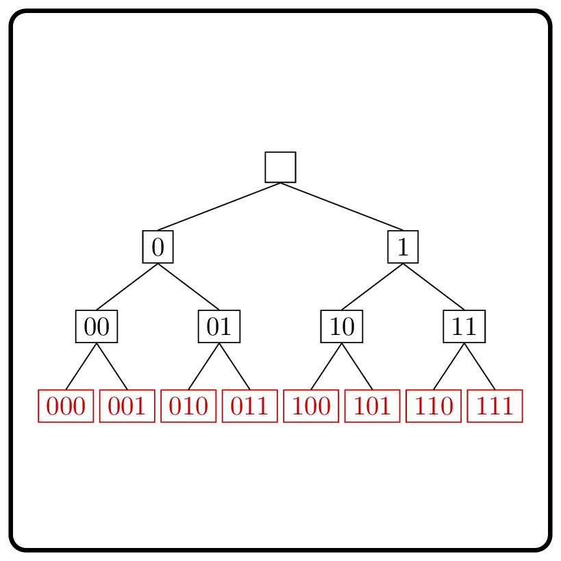

<%css "/util/common.css" %>

# Generate Binary Strings

    

Given an integer $n$, generate all binary (consisting of `'0'` and `'1'`)
strings of length $n$.
The strings should be lexicographically ordered.

### Input

Given an `Int` $n$ — the length of strings ($0 \le n \le 20$).

### Output

Return a `List<String>` that contains the required binary strings.
The list should be lexicographically ordered.

### Example

| Input | Returns                    |
|-------|----------------------------|
| `2`   | `["00", "01", "10", "11"]` |

<%include "solution.md" %>

