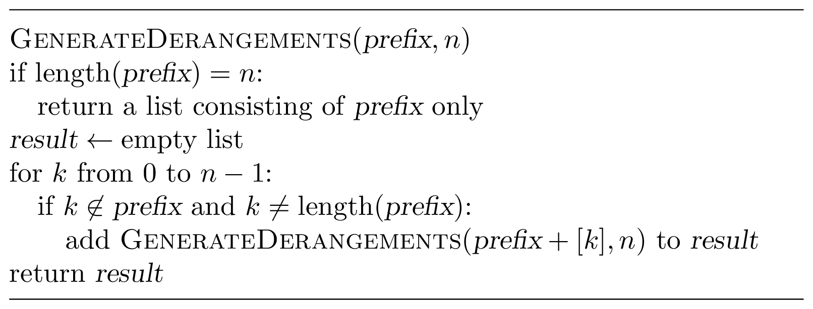

### Solution

Let $n=5$. What could be the next element in a derangement starting
with $4, 0$? It should be one of the remaining three elements: $1$, 
$2$, or $3$. At the same time, $2$ cannot follow $4, 0$ as this 
would create a fixed point.

This suggests the following recursive algorithm. Given a prefix of
a derangement, extend it by one element and proceed recursively.
This one element should not appear in the prefix and should not
form a fixed point. In order to generate all derangements in the 
lexicographical order, we enumerate the elements in the increasing 
order.

