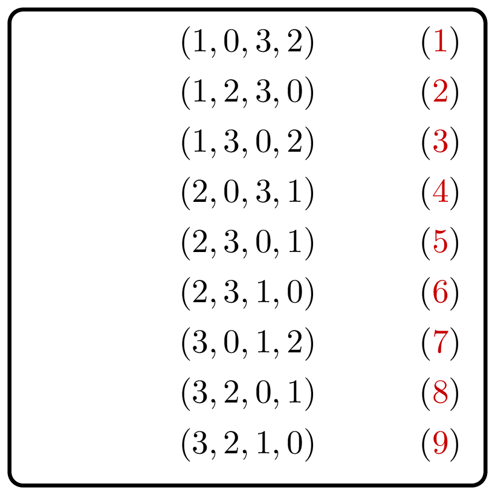

<%css "/util/common.css" %>

# Generate Derangements

    

Given an integer $n$, generate all permutations
(of the set $\lbrace 0, 1, \dotsc, n-1\rbrace$)
without fixed points, that is, all permutations 
$(p_0, \dotsc, p_{n-1})$ such that $p_i \neq i$
for all $0 \le i < n$.

### Input

Given an `Int` $n$ — the length of a permutation ($0 \le n \le 10$).

### Output

Return a `List<Derangement>` that contains the required permutations.
The list should be lexicographically ordered.

### Example

| Input | Returns                  |
|-------|--------------------------|
| `2`   | `[[1, 0]]`               |
| `3`   | `[[1, 2, 0], [2, 0, 1]]` |

Let $n=5$. How would you generate all derangements that start with 
$4, 0$?

<%include "solution.md" %>

