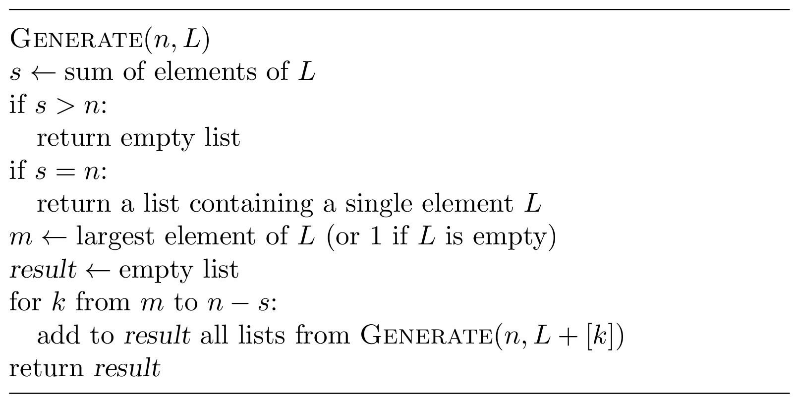

### Solution

All partitions of $n=5$ can be split into two sets: those containing 1 as 
a summand and those that do not contain it. In turn, the latter set is split
into partitions containing 2 as a summand and partitions consisting of 
integers greater than two. Continuing in the same fashion, we break all
partitions of $n=5$ into the following five categories:

* $1+\dotsb$
* $2+\dotsb$
* $3+\dotsb$
* $4+\dotsb$
* $5$

To ensure that all of them are different, it is convenient to assume 
that in every partition, the summands appear in the non-decreasing
order: this way, all partitions in, say, the $3+\dotsb$ category do not contain 1's
and 2's.

Now, let us focus on, say, the $2+\dotsb$ category. Clearly, 
everything in "$\dotsb$" should sum up to 3. But not every partition of 3 
fits our goals: all integers in this partition should be at least 2. Thus, 
the $2+\dotsb$ category can be further split into the following two 
subcategories:

* $2+2+\dotsb$
* $2+3$

Finally, the $2+2+\dotsb$ subcategory is in fact empty: it remains to get 
$1$ as a sum, but all summands should be at least 2.

This reasoning leads to the following recursive procedure 
$\operatorname{Generate}(n, L)$, where 
$n$ is the target sum and $L$ is a list of integers sorted in non-decreasing 
order. It returns all sorted partitions of $n$ that "extend" the 
list $L$. For example, for $n=5$ and $L=(1, 1)$, it returns the following
three partitions: $(1,1,1,1,1)$, $(1,1,1,2)$, $(1,1,3)$.

