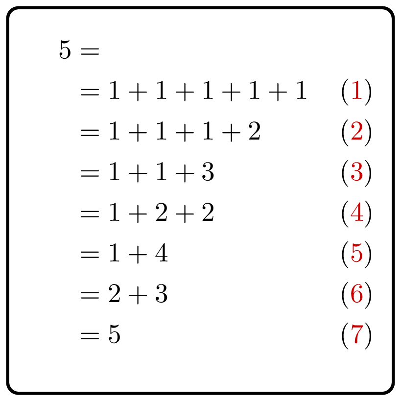

<%css "/util/common.css" %>

# Generate Partitions

    

Given a positive integer $n$, generate all its representations as 
the sum of positive integers (two representations that differ by the 
order of summands are considered the same: 
$1+3+1$ is the same as $1+1+3$ and $3+1+1$).

### Input

Given an `Int` $n$ — the sum of each partition ($1 \le n \le 60$).

### Output

Return a `List<List<Int>>` that contains all the required partitions.
Each partition is an inner `List<Int>`.
The partitions can be given in any order.
The terms of each partition can be given in any order as well.
The partitions in the list should be distinct.

### Example

| Input       | Returns                                                                                                  |
|-------------|----------------------------------------------------------------------------------------------------------|
| `4`         | `[`   `  [1, 1, 1, 1],`  `  [1, 1, 2],`  `  [1, 3],`   `  [2, 2],` `  [4]`   `]` |

How would you list all partitions of $n=5$ by hand?

<%include "solution.md" %>

