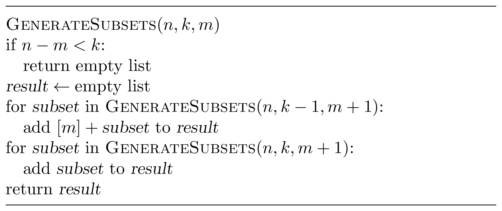

### Solution

Recall that the resulting list needs to be sorted. This suggests 
the following idea. First, generate all subsets of size $k$
containing 0. To do
this, generate recursively all subsets of size $k-1$ of the set 
$\lbrace 1, \dotsc, n-1 \rbrace$ and add $0$ to each of them.
Then, generate all subsets of size $k$ that do not contain $0$.
To do this, generate recursively all subsets of size $k-1$
of the set $\lbrace 1, \dotsc, n-1 \rbrace$.
To implement this recursive procedure, we pass to each recursive call
not only the parameters $n$ (the size of the universe set)
and $k$ (the size of subsets), but also an additional parameter $m$,
the minimum value of subsets to be generated. Thus, given $n$, $k$, 
and $m$, the procedure generates all subsets of size $k$
of the set $\lbrace m, m+1, \dotsc, n-1\rbrace$. If the number of
elements in this set, $n-m$, is smaller than $k$ (the base case of 
recursion), the resulting list is empty.

