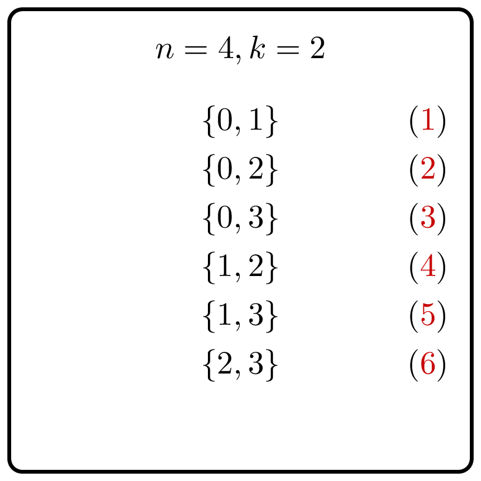

<%css "/util/common.css" %>

# Generate Subsets

    

Given integers $n$ and $k$, generate all subsets of 
the set $\lbrace 0, 1, 2, \dotsc, n - 1 \rbrace$ 
of size $k$.

### Input

Given `Int`'s $n$ and $k$ — the sizes of the set and 
the subsets, respectively ($0 \le k \le n \le 200$).

It is guaranteed that the size of the output (the number
of subsets)
does not exceed $10^6$.

### Output

Return a `List<BitSet>` that contains the required subsets.
The list should be lexicographically ordered.

### Example

| Input     | Returns                    |
|-----------|----------------------------|
| `2`, `1`  | `[[0], [1]]`               |
| `3`, `2`  | `[[0, 1], [0, 2], [1, 2]]` |

<%include "solution.md" %>

