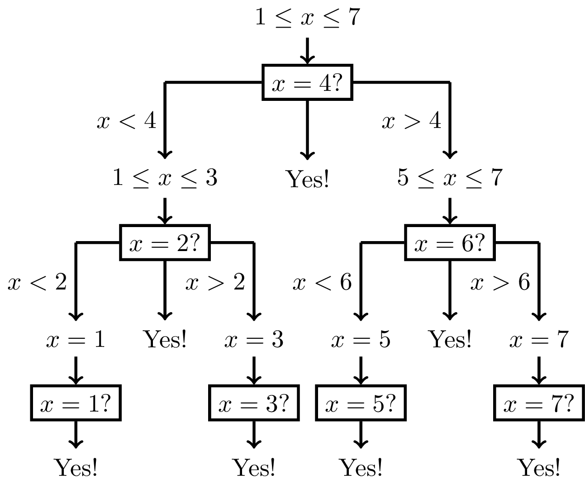

# Divide and Conquer

If you want to solve a problem using a divide-and-conquer strategy, 
you have to think about the following three steps:

 * Breaking a problem into smaller subproblems.
 * Solving each subproblem recursively.
 * Combining a solution to the original problem out of solutions to subproblems.

The first two steps is the "divide" part, whereas the last step is 
the "conquer" part.
We illustrate this approach with a number of problems of progressing 
difficulty and then proceed
to the programming challenges.

## Guess a Number

In the "Guess a Number" game, your opponent
has an integer $1 \le x \le n$ in mind.
You ask questions of the form "Is $x=y$?".
Your opponent replies
either "yes", or "$x<y$" (that is, 
"my number is smaller than your guess"), 
or "$x>y$" (that is, "my number is larger than your guess"). 
Your goal is to get the "yes"
answer by asking the minimum number of questions.
Let $n=3$: your goal is to guess $1 \le x \le 3$ by asking
at most two questions. Can you do this? 
[Try it online (level 1).](https://discrete-math-puzzles.github.io/puzzles/clock-game/index.html)

If you ask "Is $x=1$?" and get the "yes" answer, then you are done.
But what if the opponent replies
"$x>1$"? You conclude that $x$ is equal to either $2$ or $3$, but you only have one question left. 
Similarly, if you ask "Is $x=3$?", the opponent may reply "$x<3$" and you will not be able
to get the desired "yes" response by asking just one more question.

Let's see what happens if your first question is "Is $x=2$?". If the opponent replies that $x=2$, 
then you are done. If she replies
that $x<2$, then you already know that $x=1$. Hence, you just ask "Is $x=1$?" as your 
second question and get the desired "yes" response.
If the opponent replies that $x>2$, your next question "Is $x=3$?" will get the "yes" response.

**Exercise break.** Guess an integer $1 \le x \le 7$
    by asking at most three questions.
[Try it online (level 2).](https://discrete-math-puzzles.github.io/puzzles/clock-game/index.html)

You may have already guessed that you are going to start
by asking "Is $x=4$?" The reason is that in both cases, 
$x<4$ and $x>4$, we *reduce the size of the search space from 7 to 3*
(and we already know how to solve the problem for $3$ elements):

 * if $x<4$, then $x$ is equal to either 1, 2, or 3;
 * if $x>4$, then $x$ is equal to either 5, 6, or 7.

This, in turn, means that in both cases you can invoke the solution
to the previous problem. The resulting protocol
of questions is shown in the figure below.

This strategy allows you to guess an integer $1 \le x \le 2\,097\,151$ (over two million!) 
in just 21 questions.
[Try it online (level 4).](https://discrete-math-puzzles.github.io/puzzles/clock-game/index.html)

The Kotlin code on the left mimics the guessing process.
TODO: implement these methods
The function `query` "knows" an integer $x$. 
A call to `query(y)`
tells us
whether $x=y$, or $x>y$, or $x<y$. 
The function `guess()` finds the number $x$ by calling `query()`.
It is called with two parameters, `lower` and `upper`, such that
$$lower \le x \le upper,$$
that is, $x$ lies in the segment $[lower, upper]$.
It first computes the `middle` point of the segment
$[lower, upper]$ and then calls `query(middle)`.
If $x<middle$, then it continues with the interval
$[lower, middle - 1]$.
If $x>middle$, then it continues with the interval
$[middle+1, upper]$.

Try changing the value of $x$ and run this code
to see the sequence of questions (but make sure that $x$ lies
in the segment that `guess` is called with).

In general, our strategy for guessing an integer $1 \le x \le n$ will
require about $\log_2 n$ questions. Recall that $\log_2 n$ is equal to $b$ if $2^b=n$. 
This means that if we keep dividing $n$
by 2 until we get 1, we will make about $\log_2 n$ divisions.
What is important here is that $\log_2 n$ is a *slowly growing* function: 
say, if $n \le 10^9$, then $\log_2 n < 30$.
