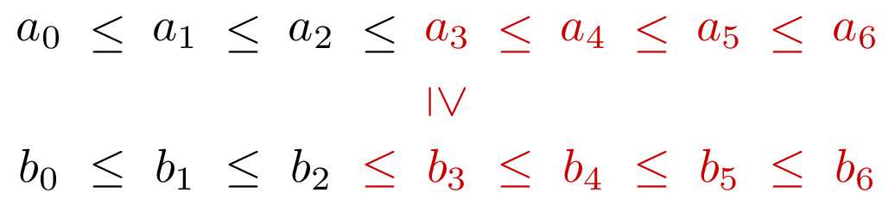

### Solution

Assume that $a_3 \ge b_3$.

In the sorted list $c_0 \le c_1 \le \dotsb \le c_{13}$,
there are *six* elements before $c_6$ and *seven* elements
after $c_6$. Note that for $a_3$, there are *at least
seven* elements that can go before $a_3$:

Also, there are *at least eight* elements that can go after $b_2$
in $c$:

Thus, we can discard $a_3,a_4,a_5,a_6$ as well as $b_0,b_1,b_2$.
The union of the resulting two lists has length 7, and we need to find its fourth
element (since we discarded three elements $b_0,b_1,b_2$ that can definitely go
before $c_6$ in $c_0 \le c_1 \le \dotsb \le c_{13}$).

This toy example not only helps us to design a divide-and-conquer algorithm,
but also reveals that in the recursive calls we may want to find the $k$-th element
(rather than the middle one) in the union of two sorted lists of different length.
Thus, we will be solving the following more general problem: given two sorted lists
$a_0 \le a_1 \le \dotsb \le a_{n-1}$ and $b_0 \le b_1 \le \dotsb \le b_{m-1}$ and
an integer $k$, find the $k$-th element in their sorted union.

Since we are looking for the $k$-th element, we may assume that $n,m \le k$
(that is, discard the elements $a_k, a_{k+1}, \dotsc, a_{n-1}$ and
$b_k, b_{k+1}, \dotsc, b_{m-1}$). Moreover, we may assume that $n=k$ and $m=k$:
if, say, $n<k$, append several dummy elements (that are larger than any other
element) to $a$. Thus, we are looking for the $k$-th element in the sorted union
of two lists $a_0 \le a_1 \le \dotsb \le a_{k-1}$ and
$b_0 \le b_1 \le \dotsb \le b_{k-1}$.
Let $c_0 \le c_1 \le \dotsb \le c_{2k-1}$
be their sorted union. Our goal is to find $c_{k-1}$.
There are $k-1$ elements
before $c_{k-1}$ and $k$ elements after $c_{k-1}$.

Let $m = \lfloor \frac{k-1}{2} \rfloor$ (then $k-2 \le 2m \le k-1$).
Start by comparing the elements $a_m$ and $b_m$.
Consider the case $a_{m}=b_m=x$.
Then, one way to sort the union of $a$ and $b$ is the following:
first come the first $m-1$ elements of $a$
and the first $m$ elements of $b$,
then come two copies of $x$, then comes the rest. Since
$2m$ is equal to $k-1$ or $k-2$,
the $k$-th element in this ordering is $x$. Thus, we return $x$.

Now, consider the case $a_m>b_m$.
In $c$, the following elements can go before $a_{m+1}$:
$a_0, \dotsc, a_{m}$ and $b_0, \dotsc, b_m$.
The number of these elements is $(m+1)+(m+1)=2m+2$.
Since $2m \ge k-2$, $2m+2 \ge k-2+2=k>k-1$.
Recall that our goal is to find $c_{k-1}$ and there are $k-1$
elements before $c_{k-1}$ in $c$.
Thus, we can discard $a_{m+1}, \dotsc, a_{k-1}$
from further consideration.
Similarly, the following elements can go after $b_{m-2}$ in $c$:
$b_{m-1}, \dotsc, b_{k-1}$ and $a_m, \dotsc, a_{k-1}$.
Their number is $(k-m+1)+(k-m)=2k-2m+1$.
Since $2m \le k-1$, $2k-2m+1 \ge 2k-(k-1)+1=k+2>k+1$.
Since there are $k+1$ elements after $c_{k-1}$ in $c$,
we can discard $b_0, \dotsc, b_{m-2}$.
Thus, the $k$-th element in the union of $a_0, \dotsc, a_{k-1}$
and $b_0, \dotsc, b_{k-1}$ is the $(k-m+1)$-th element in the union
of $a_0, \dotsc, a_{m+2}$ and $b_{m-1}, \dotsc, b_{k-1}$.

The case $a_m<b_m$ is treated similarly.

This way, we solve the problem in the divide-and-conquer manner.
At every step, $k$ is halved, hence the number of recursive calls
is $O(\log k)=O(\log(n+m))$.

