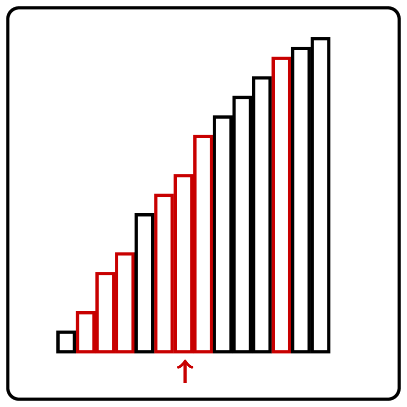

<%css "/util/common.css" %>

# Median of Two Sorted Lists

    

### Input

You are given two sorted `List<T>`'s 
$a_0 \le a_1 \le \dotsb a_{n-1}$ 
and
$b_0 \le b_1 \le \dotsb b_{n-1}$, where `T`
implements `Comparable<T>`
and $1 \le n \le 10^7$.
The lists' `get` random-access method works in constant time.

### Output

Let $c_0 \le c_1 \le \dotsb c_{2n-1}$ be a sorted union of $a$ and $b$
(since $a$ and $b$ may contain duplicates, there may exist many ways to
merge $a$ and $b$). Return $c_{n-1}$.

| Input                                       | Return value |
|---------------------------------------------|--------------|
| `[1, 2, 5]`   `[3, 4, 6]`               | 3            |
| `["a", "z", "zz"]`   `["a", "a", "zz"]` | `"a"`        |

Let $a_0 \le a_1 \le \dotsb \le a_7$ and $b_0 \le b_1 \le \dotsb \le b_7$
be two sorted lists of length $n=8$. We would like to find the median of their sorted union $c_0 \le c_1 \le \dotsb \le c_{15}$,
i.e., the $8$-th element $c_7$. Note that $c_7$ follows seven elements and is followed by eight elements in $c$.

Consider the following two prefixes of $a$ and $b$ of total length $n+1=9$: $a_0 \le a_1 \le a_2$
and $b_0 \le b_1 \le b_2 \le b_3 \le b_4 \le b_5$. Assume that $a_2 \le b_5$. Can you prove that
some of $a_i$'s and $b_i$'s can be discarded in this case?

<%include "solution.md" %>

