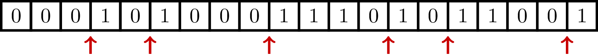

### Solution

Consider a 0/1 array where the first element is 0
and the last element is 1.
An element 0 followed by an element 1 in this array is called
a *0-1 pair*. Here is an example of an array with six 0-1 pairs.

However, you don’t see the elements
(except for the first and the last one); for you, this array looks like this:

You may point at any cell and ask a question
“What is this element?” Your goal is to find a 0-1 pair by asking
the minimum number of questions.
[Try the puzzle!](https://discrete-math-puzzles.github.io/puzzles/opposite-colors/index.html)
After solving this puzzle, you will see that the binary search is
useful even when the data is not sorted!

But how do we know that there is a 0-1 pair?
This is true because when moving from the first 0 to the last 1,
the value of a cell should eventually switch from 0 to 1 at least once.

Even though this proof works for any array that starts from 0 and ends in 1,
it is *non-constructive*: it proves that there exists a 0-1 pair but doesn't
give an *efficient method* for finding this pair
(by revealing the value of a few cells).
In particular, if we start checking the values of the cells one by one from the left,
then we will eventually find a 0-1 pair, but in the worst case, it will
require us to reveal the values of all cells.

Thus, we know that a 0-1 pair exists, but we still need to figure out an
efficient method for finding it. Inspired by our previous examples, let’s reveal
the value of the middle cell. Assume, for example, that it is 0.

**Stop and think.** If the middle cell turned out to be 0, how would you proceed?

At first sight, it does not help us much.
If we start revealing the values of its neighbor cells,
both of them may be 0's. Instead, let’s focus on the right part of the array.

Do you see? It is the same problem again! Since the leftmost cell is 0 and
the rightmost one is 1, it must contain a 0-1 pair. And its length is twice as small.
If the middle cell turns out to be 1, we can also find a subarray that
starts in 0 and ends in 1 (though of length 11, but not 10).

Hence, in any case, we decrease the size by a factor of (almost) two: from
a starting array of length $n$, we get an array of length $\lceil \frac{n+1}{2} \rceil$.
Thus, after revealing the values of at most five cells, we will find a 0-1 pair.
Indeed, even in the worst possible case, the size of the array will shrink as follows:
$20 \to 11 \to 6 \to 4 \to 3 \to 2$.
