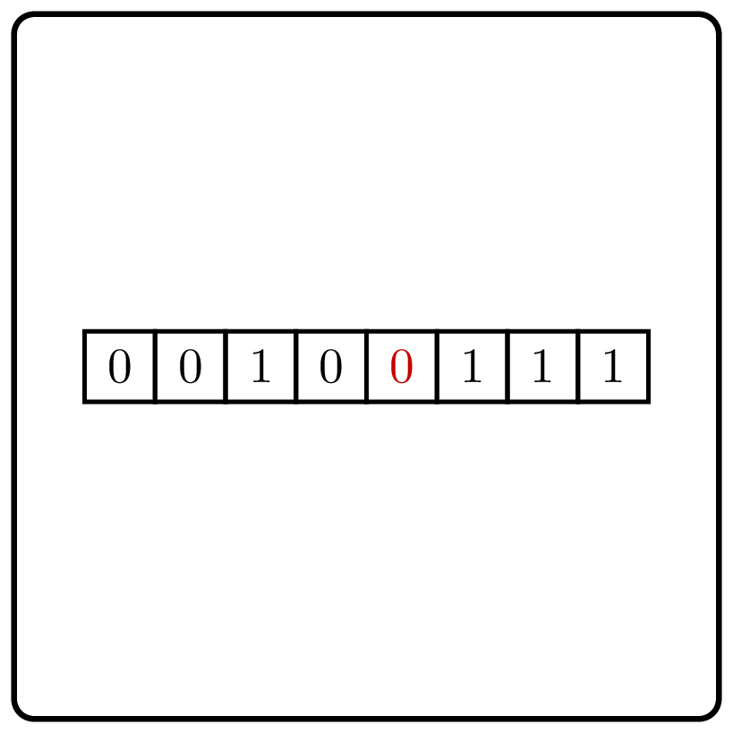

<%css "/util/common.css" %>

# Find two adjacent elements with opposite values 

    

Given a binary sequence that starts with zero and ends with one,
find any occurrence of zero that is followed by one.

In [Task.kt](course://Divide and Conquer/Opposite Values/src/Task.kt), you already have a slow solution implemented using a standard library function.
Make it work faster to pass the tests.

| Input    | Return value |
|----------|--------------|
| `000101` | 2            |
| `000101` | 4            |
| `000111` | 2            |

Use binary search.

<%include "solution.md" %>

