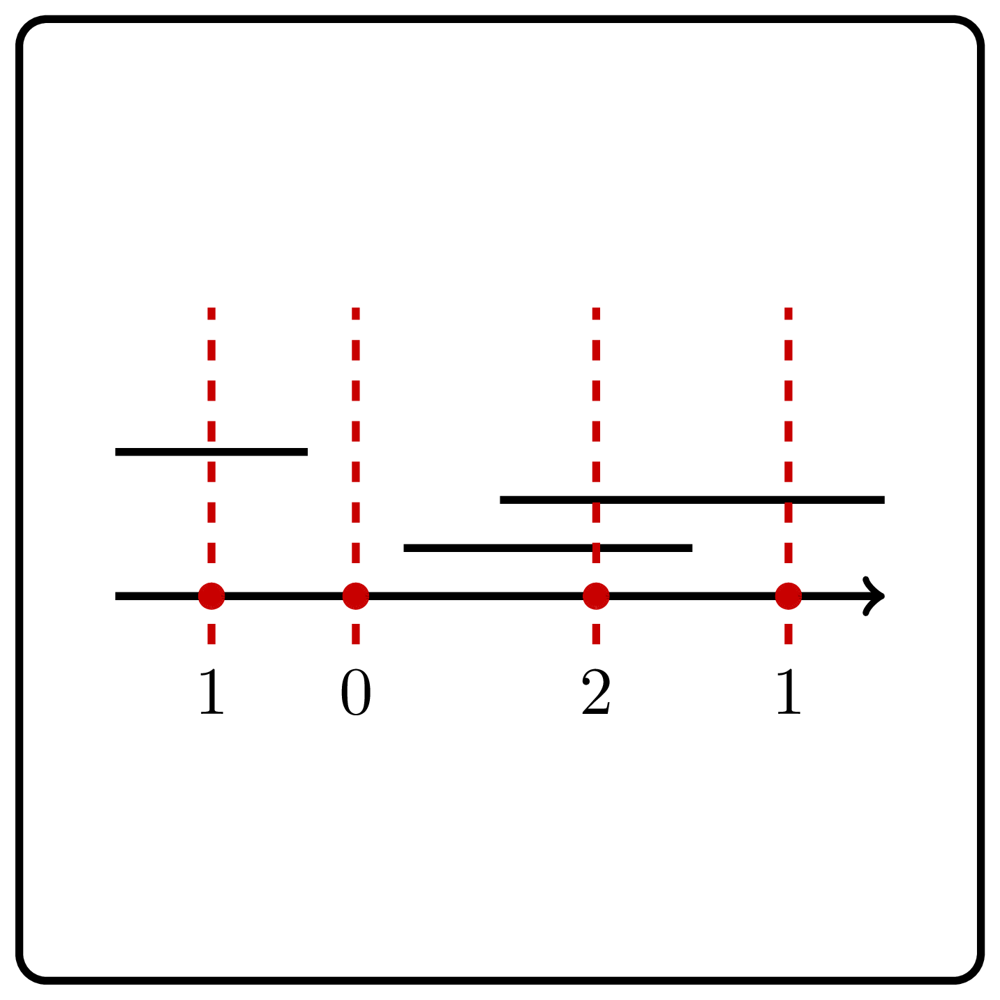

<%css "/util/common.css" %>

# Points and Segments

<div class="logo">
    
</div>

Implement a function that given a set of points and a set of segments on a line, computes, for each point, the number of
segments it is contained in.

```Kotlin
fun countSegmentsForEach(points: IntArray, segments: Array<Pair<Int, Int>>): IntArray
```

### Input

An `IntArray` $x_0, x_1, \ldots, x_{n - 1}$ defining the points,
and an `Array<Pair<Int, Int>>` $[l_0, r_0], \ldots, [l_{m - 1}, r_{m - 1}]$
defining the segments.

The number of points doesn't exceed $300\,000$.

The number of segments doesn't exceed $300\,000$.

All the coordinates don't exceed $10^9$ by their absolute value.

### Output
An `IntArray` $d$ representing the number of segments containing each point, more formally $d_i$ should contain
the number of segments $[l_j, r_j]$ that contain point $x_i$.


<div class="samples">

| Input                                 | Return value |
|---------------------------------------|--------------|
| `[1, 6, 11]` `[[0, 5], [7, 10]]`      | `[1, 0, 0]`  |
| `[-100, 100, 0]` `[[-10, 10]]`        | `[0, 0, 1]`  |
| `[1, 6]` `[[0, 5], [-3, 2], [7, 10]]` | `[2, 0]`     |


</div>

<div class="hint">
<%include "solution.md" %>
</div>