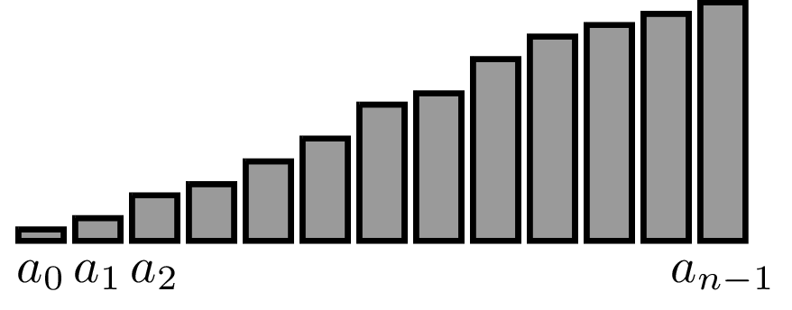
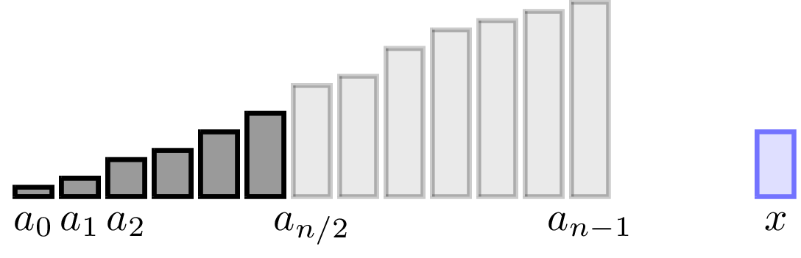

## Searching Sorted Data

The method that we used for guessing a number is known
as the *binary search*.
Perhaps the most important application of binary search 
is *searching sorted data*. Searching is a fundamental problem: 
given a sequence and an element $x$, we would like to check whether 
$x$ is present in this sequence. For example, $3$ is present in the 
sequence $(7, 2, 5, 6, 11, 3, 2, 9)$ and $4$ is not present in this 
sequence. Given the importance of the search problem, it is not 
surprising that Kotlin has built-in methods for solving it.

TODO: show how to use the `find` method

What is going on under the hood when one calls this
`find` method? As you would expect, Kotlin
simply performs a *linear scan*.
This linear scan makes up to $n$ comparisons on a sequence
of length $n$. If the sequence does not contain $x$, we *have to* scan all the elements: 
if we skip an element, we
can't be sure that it is not equal to $x$.

Things change drastically if the given data is *sorted*,
i.e., forms a sorted sequence $a_0, \dotsc, a_{n-1}$ in increasing order.

It turns out that in this case about $\log_2 n$ comparisons are enough!
This is a great speedup:
the linear scan of a sorted array with a billion elements will take
a billion comparisons, but binary search makes at most $\log_210^9<30$ comparisons!

The idea is again to try to half the search space. To do this,
we compare
$x$ with $a_{n/2}$. If $x=a_{n/2}$, then we are done. If $x<a_{n/2}$,
then $x$ can only appear in the first half of the array, implying 
that the right half can be discarded.

Similarly, if $x>a_{n/2}$, we discard the left half of the sequence 
as all its elements are certainly smaller than $x$:

This leads us to the implementation shown on the left.
