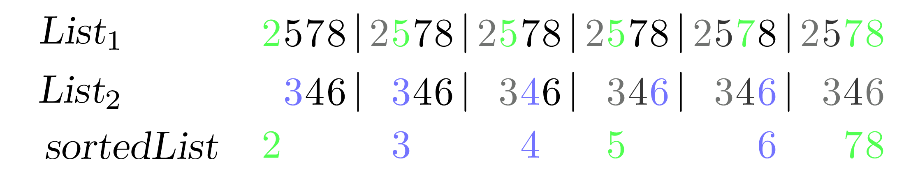
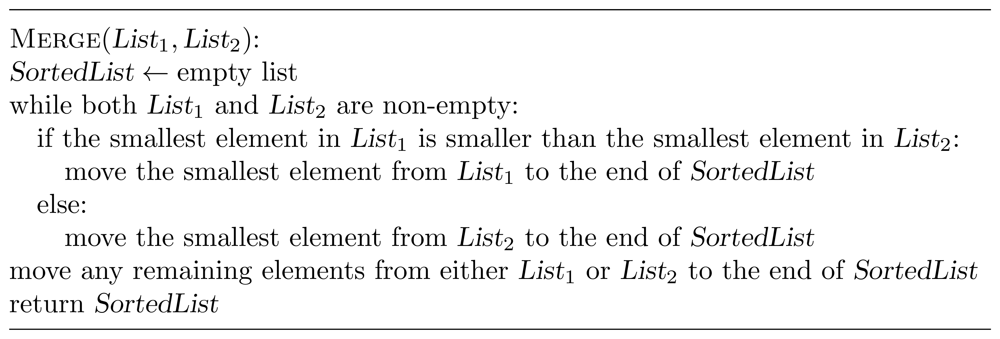
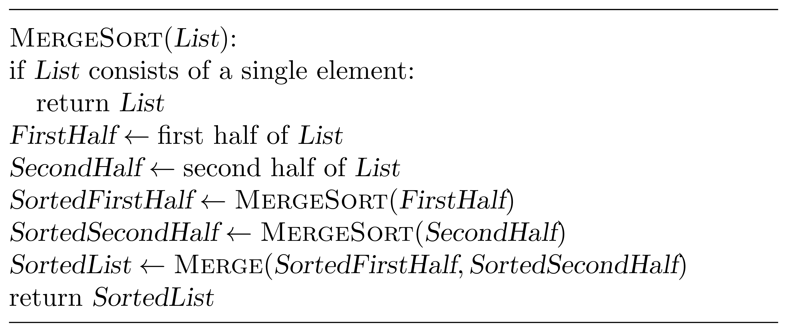
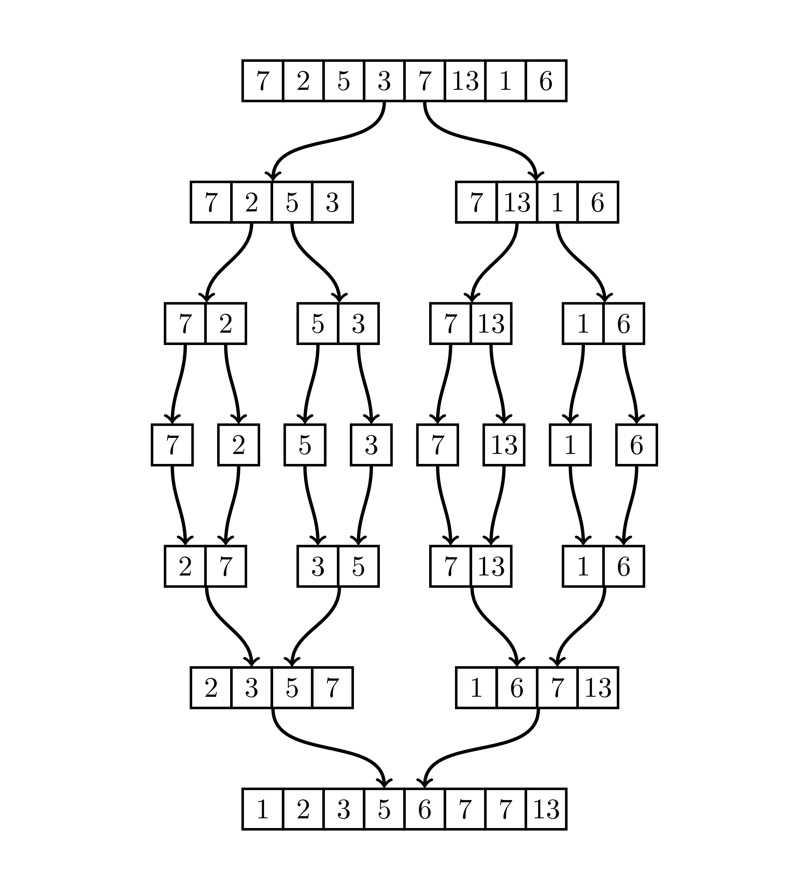

<%css "/util/common.css" %>

# Sorting Data

Sorting is a fundamental algorithmic problem: given a list of $n$ integers,
rearrange them in non-decreasing order. Most known efficient 
algorithms for this task are based on the divide-and-conquer strategy
and have running time $O(n\log n)$.
In this module, we describe one such algorithm known as MergeSort.

We begin from the problem of *merging*, in 
which we want to combine two sorted lists 
${List}_1$ and ${List}_2$ into a single sorted list.

The $Merge$ algorithm combines two sorted lists into a 
single sorted list in $O(|{List}_1| + |{List}_2|)$  time by 
iteratively choosing the smallest remaining element in 
${List}_1$  and ${List}_2$  and moving it to the growing sorted list.

$Merge$ would be useful for sorting an arbitrary list if we knew 
how to divide an arbitrary (unsorted) list into two already 
sorted half-sized lists. However, it may seem that we are back to 
where we started, except now we have to sort two smaller lists instead 
of one big one. Yet sorting two smaller lists is a preferable algorithmic 
problem. To see why, let's consider the $MergeSort$ algorithm, which 
divides an unsorted list into
two parts and then recursively conquers each smaller sorting problem 
before merging the sorted lists.

The figure below shows the recursion tree of $MergeSort$, 
consisting of $\log_2 n$  levels, where $n$ is the size of the original unsorted list.

At the bottom level, we must merge two sorted lists of approximately $n /2$ elements each, 
requiring $O(n /2 + n /2)  = O(n)$ time. At the next highest level, we must merge four lists 
of $n /4$ elements, requiring
$O(n /4 + n /4 + n /4 + n /4)  = O(n)$  time. This pattern can be generalized: 
the $i$-th level contains $2^i$  lists, each having approximately $n /2^i $ elements, 
and requires $O(n)$ time to merge. Since there are $\log_2 n$  levels in the recursion tree, 
\myproc{MergeSort} requires $O(n   \log_2 n)$ runtime overall.