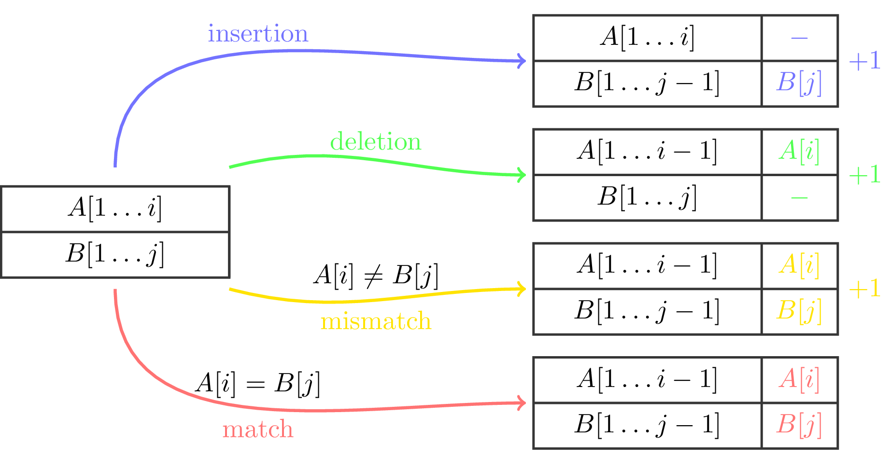
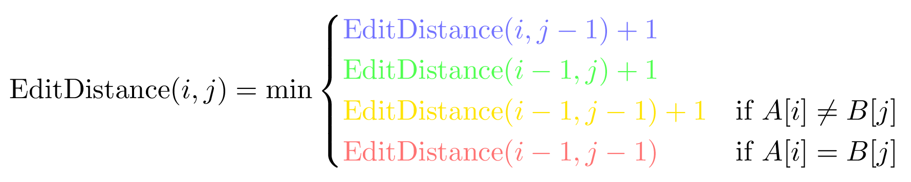
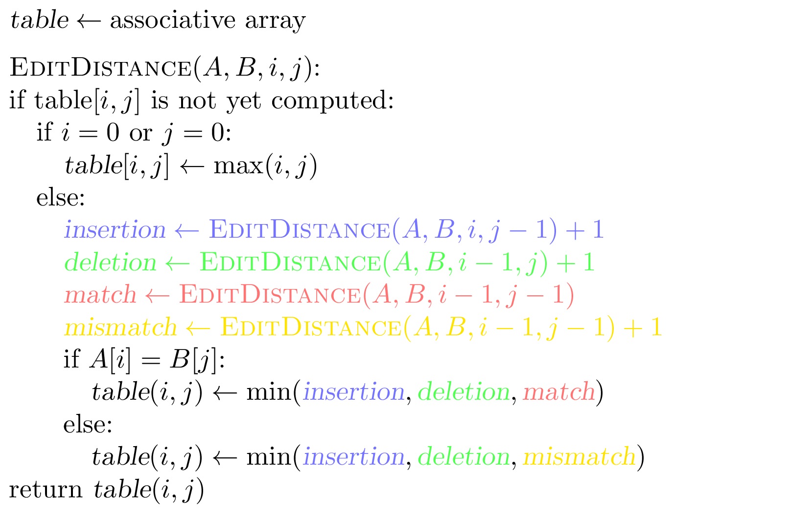
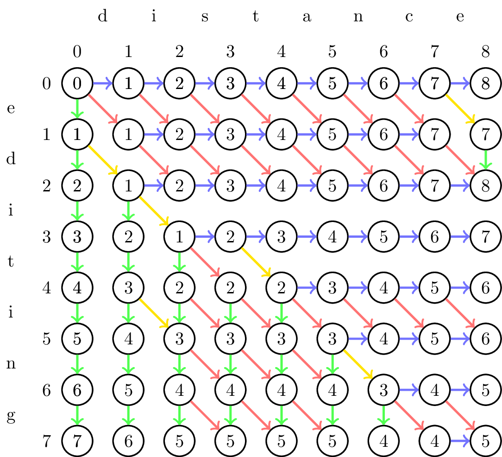

### Solution

An *alignment* of two strings is
a two-row matrix such that the first (second) row contains the
ordered symbols of the first (second) string, interspersed with the
space ("$-$") symbols in such a way that no two space symbols appear
in the same column.

We classify the columns of an alignment as follows:
* a column with a symbol and a space is a *deletion*;
* a column with a space and a symbol is an *insertion*;
* a column with two equal symbols is a *match*;
* a column with two different symbols is a *mismatch*.

An alignment is *optimal* if it minimizes the total number
of mismatches, deletions, and insertions among all possible alignments.

In the example above, the last column represents an insertion.
By dropping this column, we get an optimal alignment of
the first string and a prefix of the second string.
Here is an idea — let's compute the edit distance
between each pair of prefixes of two strings.

Given strings $A[1\dotsc n]$ and $B[1 \dotsc m]$,
we consider their prefixes $A[1\dotsc i]$ and $B[1 \dotsc j]$
of length $i$ and $j$ and denote the edit distance between them
as $\operatorname{EditDistance}(i,j)$.
The last column of an optimal alignment of
$A[1 \dotsc i]$ and $B[1 \dotsc j]$ is either
an insertion,
a deletion,
a mismatch,
or a match.

Then,

The base case for this recurrence relation is $i=0$ and $j=0$:
$$\operatorname{EditDistance}(0,j)=j \quad \text{and} \quad \operatorname{EditDistance}(i,0)=i.$$
This can be stated more compactly as follows: if $i=0$ or $j=0$, then
$$\operatorname{EditDistance}(i,j)=\max\lbrace i,j \rbrace.$$

The pseudocode below converts this recurrence relation into a recursive algorithm and uses memoization to avoid computing the same thing again.

The running time of this algorithm is $O(nm)$, as there are at most $nm$
recursive calls that are not just table lookups.

The recursive algorithm computes $\operatorname{EditDistance}(i,j)$ for all
$0 \le i \le n$ and $0 \le j \le m$. One can turn the recursive algorithm into an iterative one that stores the solutions to all
subproblems in a two-dimensional table. We fill in the table by traversing it row by row. This ensures that by the time we compute
the value of the $(i,j)$ cell, the values of the cells $(i,j-1)$, $(i-1,j)$
and $(i-1,j-1)$ are already computed.

The resulting table for our working example is shown below.
The value in each cell is computed from the values of its top,
left, and top-left neighbors. For each cell, the incoming arrows
indicate one or more out of the four cases
(insertion,
deletion,
mismatch,
match) that lead to the
value of this cell.

The table corresponds to a DAG where all edges have
length $1$ except for match edges,
which correspond to matching symbols and have length $0$.
The algorithm
finds the shortest path in this graph from the top-left node to the bottom-right node.

