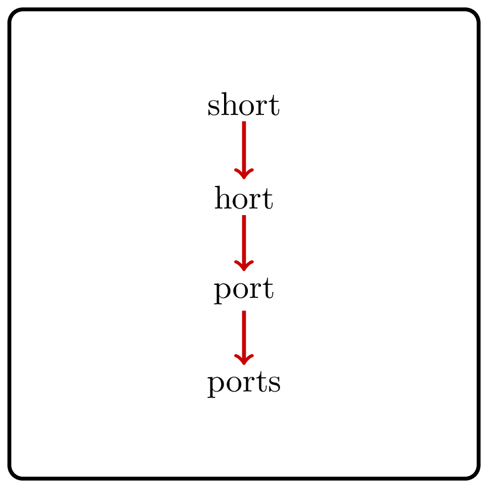

<%css "/util/common.css" %>

# Edit Distance

    

Given two strings, compute the minimum number
of single-symbol insertions, deletions, and substitutions to transform one
string into the other one.

The corresponding similarity measure is called the *edit distance*
between two strings. It has 
applications in computational
biology, natural language processing, spell checking, and many other areas.
For example, biologists often compute edit distances when they search for
disease-causing mutations.

### Examples

| Input                  | Returns |
|------------------------|---------|
| `"short" "ports"`      | 3       |
| `"editing" "distance"` | 5       |
| `"ab" "ab" `           | 0       |

A way to transform one string into the other can be 
compactly visualized as an *alignment*:
a two-row matrix such that the first (second) row contains the 
ordered symbols of the first (second) string, interspersed with the 
space ("$-$") symbols in such a way that no two space symbols appear 
in the same column.

We classify the columns of an alignment as follows:
* a column with a symbol and a space is a *deletion*;
* a column with a space and a symbol is an *insertion*;
* a column with two equal symbols is a *match*;
* a column with two different symbols is a *mismatch*.

An alignment is *optimal* if it minimizes the total number
of mismatches, deletions, and insertions among all possible alignments.

Consider an optimal alignment of two strings and assume that its last column
is an insertion. What can you say about the alignment resulting from the current
one by dropping its last column?

There are four possibilities for the last column of an optimal alignment
of two strings. In any of the four cases, all columns of this alignment
but the last one form an optimal alignment of prefixes of the two strings.
Can you write down a recurrence relation based on this observation?

<%include "solution.md" %>

