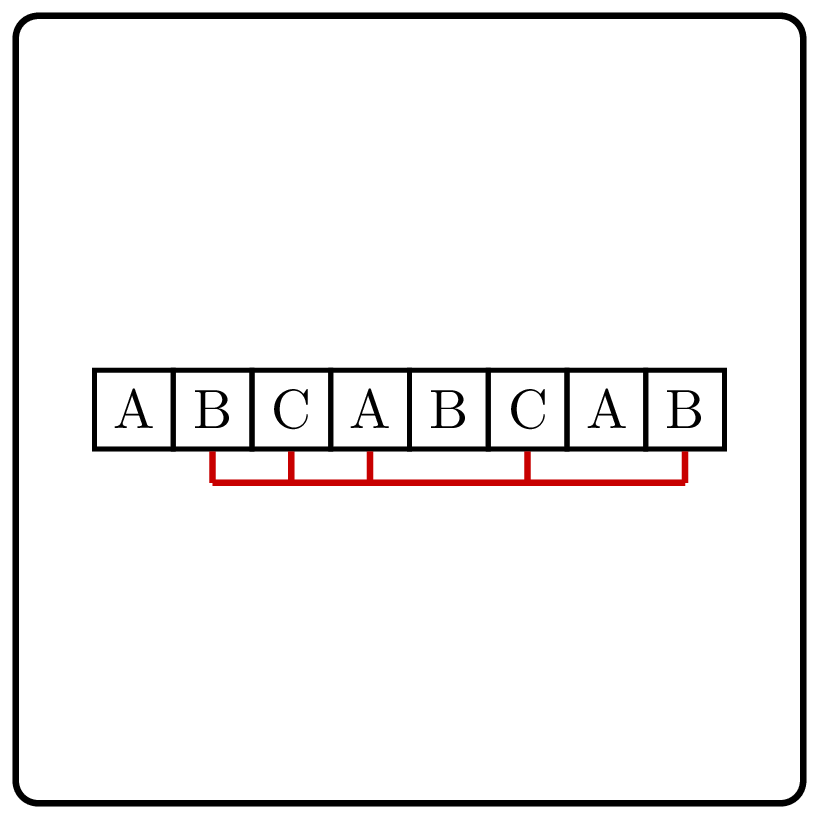

<%css "/util/common.css" %>

# Longest Palindromic Subsequence

    

Given a string, find the longest palindromic subsequence of this string, 
i.e., a subsequence that reads the same backward and forward.

This subsequence does not have to be contiguous.

### Input

A string consisting of lowercase English letters.
The length of the string doesn't exceed $5\ 000$. 

### Output

A string of maximum length that is a subsequence of the given string
and a palindrome at the same time.

If multiple answers exist, return any.

### Examples

| Input          | Returns     |
|----------------|-------------|
| `"bmczhadaem"` | `"madam"`   |
| `"abacaba"`    | `"abacaba"` |
| `"kotlin"`     | `"k"`       |

Focus on the first and the last symbols of the string. Either both of them appear
in the longest palindromic subsequence or at most one of them. Can you write
down a recurrence relation based on this observation?

<%include "solution.md" %>

