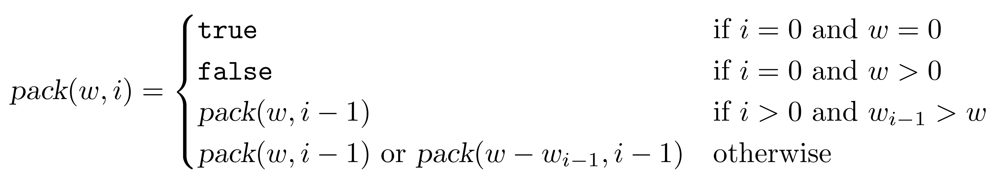
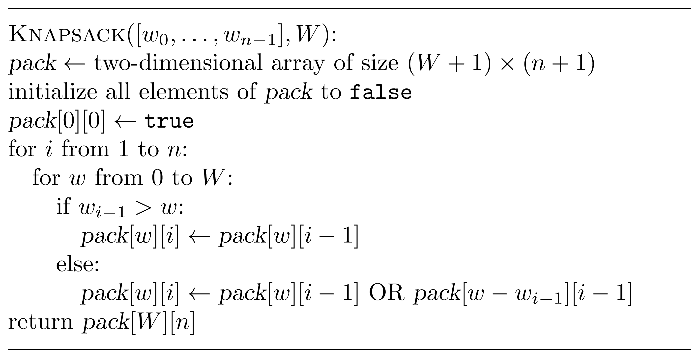

## Solution

Instead of solving the original problem, we will check
whether it is possible to fully pack our backpack with the gold bars: 
given $n$ gold bars of weights $w_0, \dotsc, w_{n-1}$ (we switched to the 0-based indexing) 
and an integer $W$, is it possible to select a subset of them with the total weight $W$?

**Exercise break.** Show how to use the solution to this problem to solve the Maximum Amount of Gold problem.

Assume that it is possible to fully pack the backpack: there exists a set 
$S \subseteq \lbrace w_0, \dotsc, w_{n-1}\rbrace$ of total weight $W$. Does it include the last bar of weight $w_{n-1}$?
* Case 1: If $w_{n-1} \not \in S$, then a backpack of capacity $W$ can be fully packed using the first $n-1$ bars.
* Case 2: If $w_{n-1} \in S$, then we can remove the bar of weight $w_{n-1}$ from the backpack, and the remaining bars will have weight $W-w_{n-1}$. Therefore, a backpack of capacity $W-w_{n-1}$ can be fully packed  with the first $n-1$ gold bars.

In both cases, we reduced the problem to essentially the same problem with a smaller number of items and 
possibly smaller backpack capacity. We thus consider the variable ${pack}(w, i)$ equal to ${\tt true}$ if it is 
possible to fully pack a backpack of capacity $w$ using the first $i$ bars and ${\tt false}$ otherwise. 
The analysis of the two cases above leads to the following recurrence relation for $i>0$:

$${pack}(w,i)={pack}(w,i-1) or {pack}(w-w_{i-1},i-1) . $$

Note that the second term in the above formula does not make sense when $w_{i-1} > w$.
Also, ${pack}(0, 0) = {\tt true}$  and ${pack}(0,w) = {\tt false}$ for any $w > 0$.
Overall,

As $i$ ranges from 0 to $n$ and $w$ ranges from 0 to $W$, we have $O(nW)$ variables. Since ${pack}(\cdot,i)$ depends on ${pack}(\cdot,i-1)$, we process all variables in the increasing order of $i$. In the pseudocode below, we use a two-dimensional array {pack} of size $(W+1) \times (n+1)$: ${pack}[w][i]$ stores the value of ${pack}(w,i)$. The running time of this solution is $O(nW)$.

The two-dimensional table below presents the results of the call to 
${Knapsack}([1,3,4], 8)$ and uses F and T to denote ${\tt false}$ and 
${\tt true}$ values.

