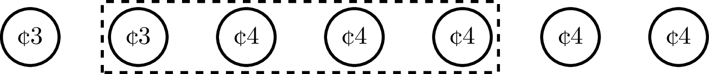
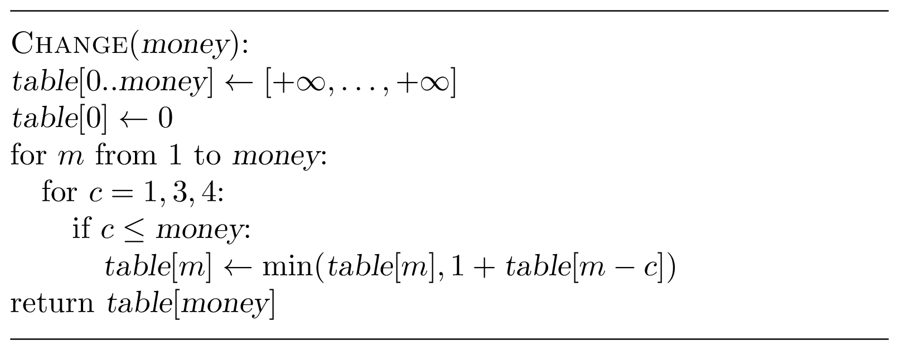

### Solution

The optimal way to change $26$ cents requires seven coins. Let's consider
an arbitrary subset of the optimal solution: e.g., the four coins within
a rectangle shown below sum up to $15$.

**Stop and think!** Can you change $15$ cents with three coins?

The answer to this question is "no" — 
if there was a way to change $15$ with three coins, 
one would replace the highlighted four coins and get a change of 
$26$ with six coins (rather than seven).

This toy example reveals an important property that many problems 
solved by the dynamic programming technique share:

> a solution to a problem contains solutions to all its smaller subproblems.

This property allows one to find a solution for a problem by solving smaller 
subproblems first.

Let ${change}({money})$ be the minimum number of coins of 
denominations $1$, $3$, and $4$ needed to change ${money}$
and $(c_1,\dotsc,c_k)$ be an optimal change for ${money}$ so that
$$c_1+\dotsb+c_k= {money}.$$
Then, 
$$c_1+\dotsb+c_{k-1}= {money}-c_k.$$
Hence, ${change}({money}-c_k)=k-1$.
Thus, to solve the problem for ${money}$, it is
enough to solve it for ${money}-c_k$ and add one.

**Stop and think!** Are we done?

The issue here is that we don't know the value of $c_k$. Still,
we know that $c_k$ is equal to either $1$, or $3$, or $4$. Hence, ${change}({money})$ is equal to one of the following:

 * ${change}({money}-1)+1$,
 * ${change}({money}-3)+1$, and
 * ${change}({money}-4)+1$.

Since we are looking for an optimum way to change,
${money}$ is equal to the minimum of these three expressions.
This leads us to the following recurrence relation:

$${change}({money})=1+\min({change}({money}-c) \colon c \in \{1, 3, 4\}, c \le {money}).$$

This relation expresses the values of the function {change} recursively through its own values on smaller arguments. For such a descending recursion, we need to specify a base case. In our case,
it is ${money}=0$: ${change}(0)=0$.

The equation
above
is **the most important part of a dynamic programming algorithm**. In fact,
it is straightforward to turn it into a recursive algorithm.

There is a serious issue with this algorithm:
it becomes prohibitively slow because it calls
$\operatorname{Change}({money})$ over and over again for the
same value of $money$.
A standard way to avoid this is known as *memoization*: 
when $\operatorname{Change}({money})$ is computed, let's store it in a table
so that we never need to compute it again.

Such an algorithm is already good enough in practice, though it still has some inefficiencies: recursive calls and lookups in an associative array
have an overhead. Noting that all the values that we need to compute are consecutive integers, we can implement a better approach, which uses an array for storing solutions to all problems.

The running time of this algorithm is $O(money)$, as every 
iteration of the outer for-loop takes constant time.
