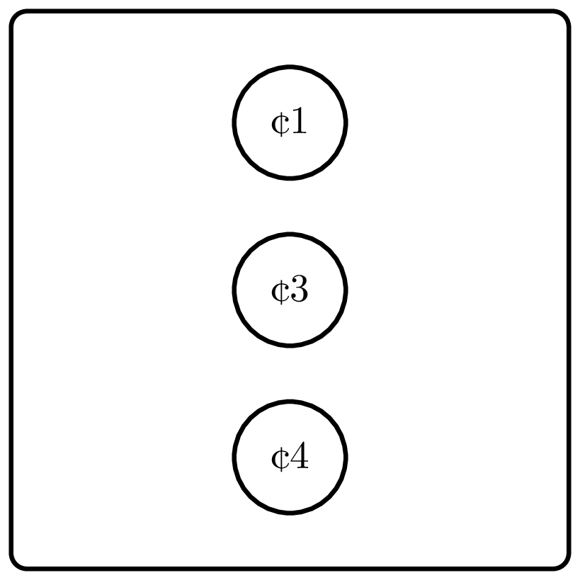

<%css "/util/common.css" %>

# Money Change Again

    

Compute the minimum number of coins needed to change 
the given value into coins with denominations 1, 3, and 4.

### Input

An `Int` ${money}$ — the value to change ($0 \le {money} \le 10^6$).

### Output

Return an `Int` representing the minimum number of coins.

| Input | Return value |
|-------|--------------|
| `15`  | `4`          |
| `26`  | `7`          |

<%include "solution.md" %>

