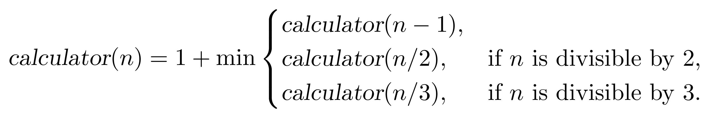
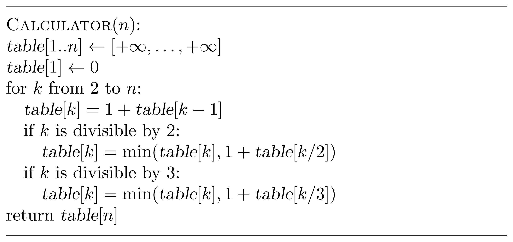
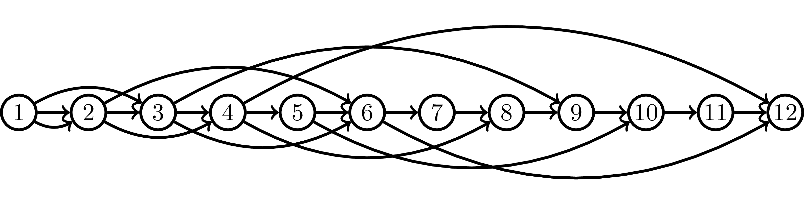

## Solution

Let ${calculator}(n)$ be the minimum number of operations needed 
to get $n$ from $1$. Since the last operation in an optimum
sequence of operations is "$+1$", "$\times 2$", or 
"$\times 3$", we get the following recurrence relation for $n \ge 1$:

This recurrence relation, together with the base 
case ${calculator}(1)=0$, can be mechanically converted into
a recursive and then into an iterative algorithm.

Recall, however, that besides the optimum value, we are asked
to output an optimum sequence of operations. To do this, let us notice that we can find the last operation as follows:
* it is "$+1$" if ${calculator}(n)=1+{calculator}(n-1)$;
* it is "$\times 2$" if $n$ is divisible by $2$ and ${calculator}(n)=1+{calculator}(n/2)$;
* it is "$\times 3$" if $n$ is divisible by $3$ and ${calculator}(n)=1+{calculator}(n/3)$.

This allows us to uncover an optimum sequence as follows:
* find the last operation;
* replace $n$ by $n-1$, $n/2$, or $n/3$ (depending on which of the three cases above happens);
* iterate (while $n>1$).

The running time of the algorithm is $O(n)$.

The algorithm finds implicitly the shortest path in a DAG like the one below.

