In this chapter, you will implement various dynamic programming algorithms and 
will see how they solve problems that evaded all our attempts to solve them using 
greedy or divide-and-conquer strategies. There are countless applications of 
dynamic programming in practice ranging from searching for similar Internet 
pages to gene prediction in DNA sequences. You will learn how the same idea helps 
to automatically make spelling corrections and to find the differences between 
two versions of the same text.

## Number of Paths

To "invent" the key idea of the dynamic programming technique,
try to solve the following puzzle.

**Interactive Puzzle "Number of Paths".**
There are many ways of getting from $s$ to $t$ in the
network below: for example, $s \to b \to e \to t$ and $s \to a \to c \to d \to t$. 

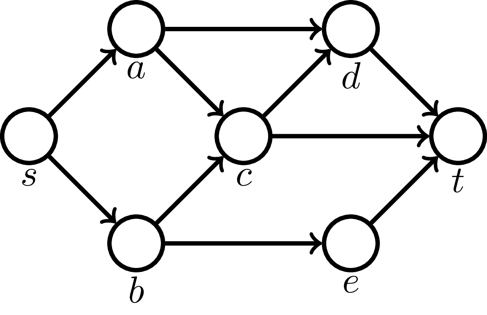

What is the total number of paths?
[Try it (level 1)!](https://discrete-math-puzzles.github.io/puzzles/number-of-paths/index.html)

Since we start from $s$, there is a unique way
to get to $s$. Let's write it down:

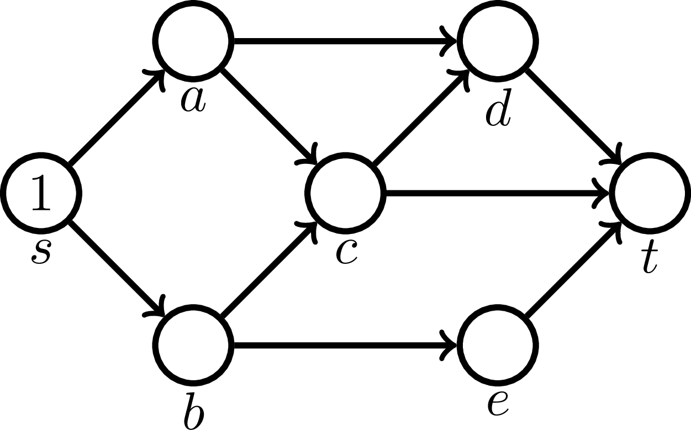

For $a$ and $b$, there is also just a single path.

Since there is only one path to $a$ and only one path to $b$, the number of paths
to $c$ is $1+1=2$ ($s \to a \to c$ and $s \to b \to c$).

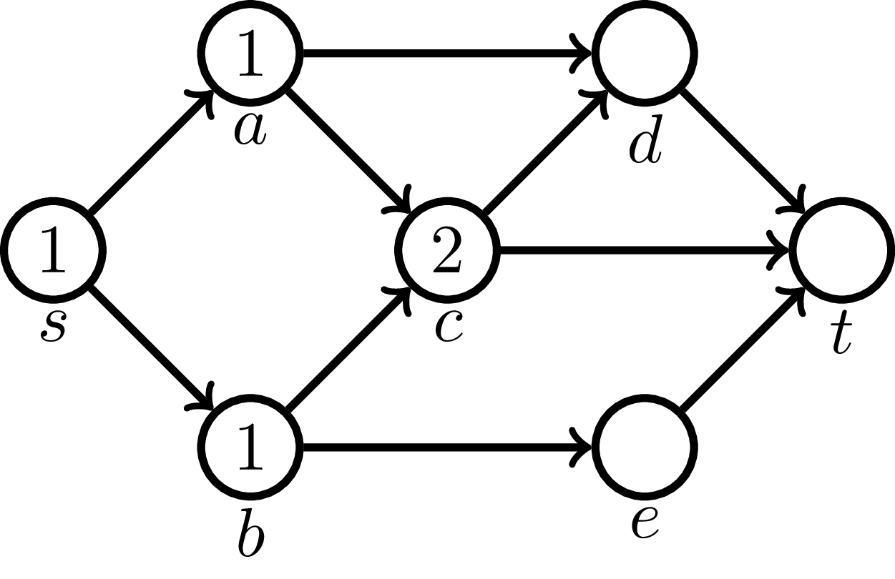

Similarly, to get to $d$, one first needs to get to either $a$ or $c$. 
There is one path to get to $a$ and two paths to get to $c$. 
Hence, the number of paths to get to $d$ is $1+2=3$ 
($s\to a \to d$, $s\to a \to c \to d$, and $s\to b \to c \to d$).

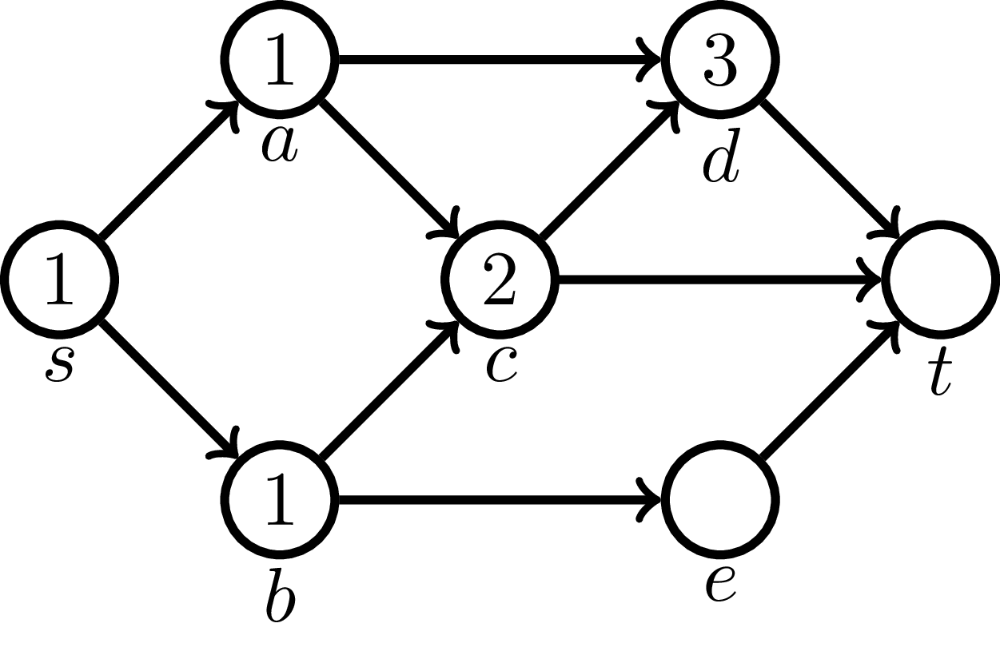

The number of paths ending in $e$ is equal to $1$, as $e$ can be reached from $b$ only.

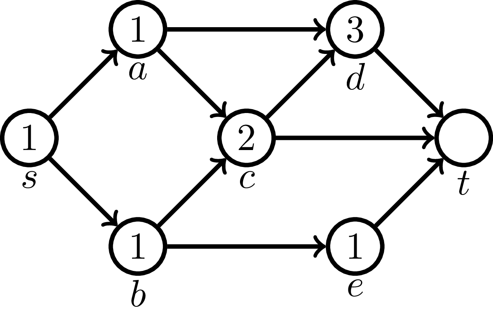

Since there are two paths to $c$, three paths to $d$, and one 
path to $e$, there are $2+3+1=6$ paths to $t$.

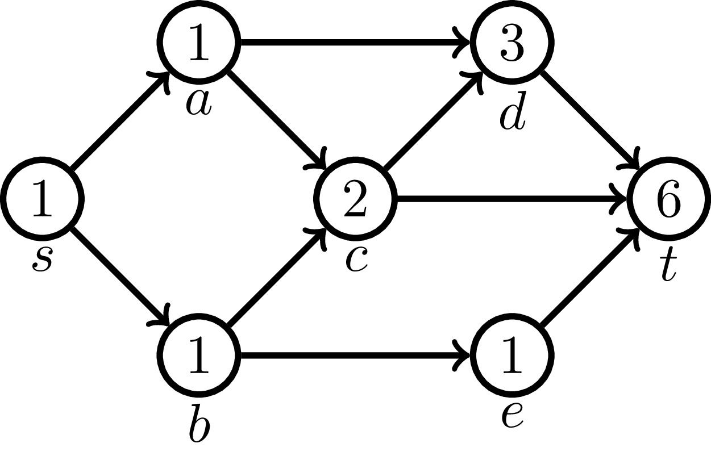

**Exercise break.**
Find the number of ways to get from $s$ to $t$ in the following three networks.
[Try it (levels 2-4)!](https://discrete-math-puzzles.github.io/puzzles/number-of-paths/index.html)

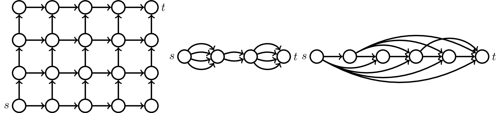

## Dynamic Programming

Let's review our solution of the Number of Paths puzzle
to state the main ideas of dynamic programming.
For a node $v$, let ${paths}(v)$
be the number of paths from $s$ to a node $v$. Clearly, ${paths}(s)=1$.
This is called a *base case*.
For all other nodes, the corresponding value can be found using
a *recurrence relation*: $paths(v)$ is equal to the sum of $paths(w)$
over all predecessors $w$ of $v$,
where a predecessor of $v$ is a node that has an edge connecting 
it with $v$.

Many dynamic programming algorithms follow the same pattern:
* Instead of solving the original problem, the algorithm solves a bunch of subproblems of the same type.
* The algorithm computes a solution to every subproblem through a recurrence relation involving solutions to smaller subproblems.
* The algorithm stores solutions to subproblems to avoid recomputing them again.

## Shortest Path in Directed Acyclic Graph
Now, consider a *weighted graph* where each edge $e$ has length denoted
${length}(e)$. The length of a path in the graph is defined as the sum of 
its edge lengths.

For example, the length
of a path $s \to b \to e \to t$ is $5+7+4=16$. What is the minimum length
of a path from $s$ to $t$?

Since each path from $s$ to $t$ passes through either $c$, $d$, or $e$ before entering into  $t$,

$${length}(t)=\min \lbrace {length}(c)+6, {length}(d)+8, {length}(e)+4 \rbrace $$

where ${length}(v)$ is the minimum length
of a path from $s$ to $v$. The distances to $c$, $d$, and $e$
can be found using similar recurrence relations:

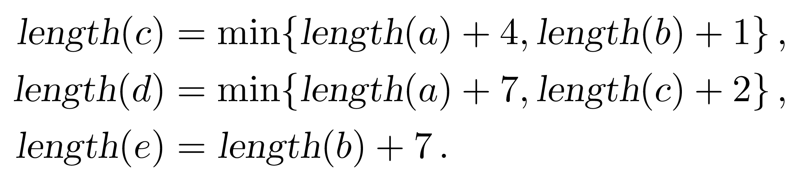

The recurrence relations for $a$ and $b$ are the following:

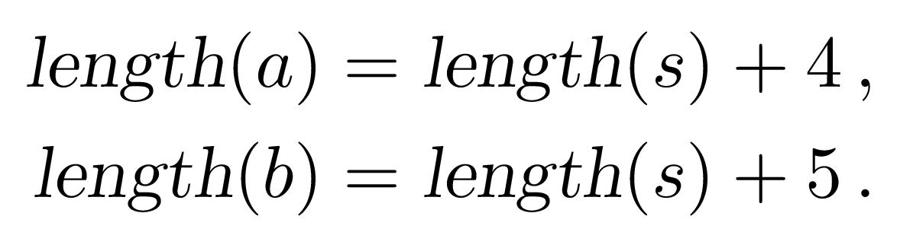

Finally, the base case is ${length}(s)=0$. Using this base case,
one can find the distances to all the nodes in the network, including the target node $t$, through the recurrence relations given above. All of them
can be compactly written as follows:

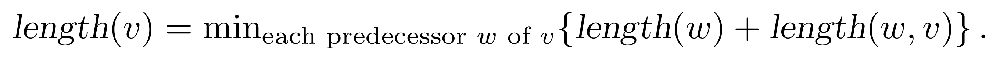

For our toy example, it is convenient to write the results down as we compute them,
right in the picture. The result looks like this:

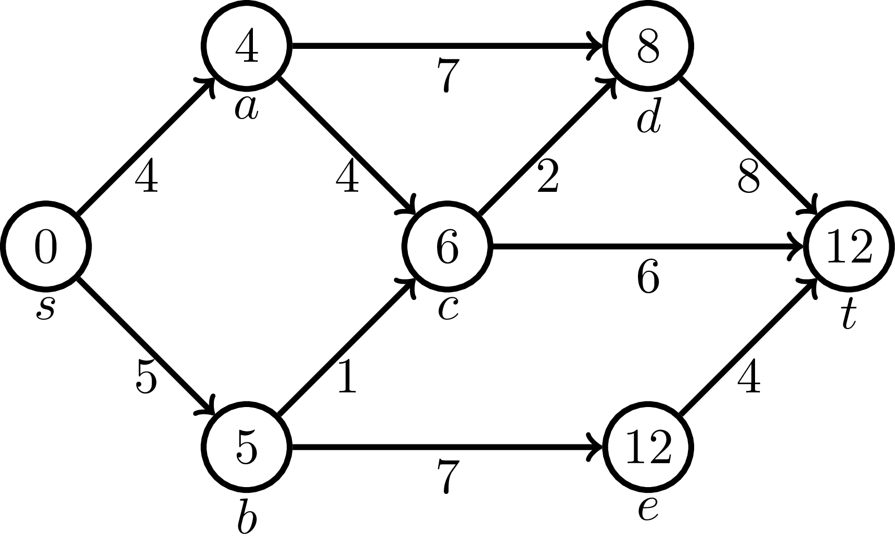

**Stop and think.** The minimum length of a path from $s$ to $t$ is $12$.
Do you see how to find a path of this length?

In dynamic programming algorithms, this is done by backtracking
the choices that led to an optimum result. Specifically, let's highlight
one of the three choices that lead to the value of ${length}(t)$:

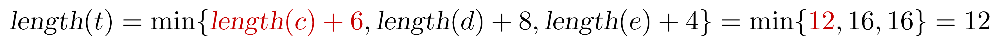

From this, we conclude that the last edge of an optimum path is $c \to t$.
Similarly,

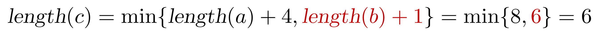

Hence, we arrive at $c$ from $b$. Thus, the path from $s$ to $t$ of 
length $12$
is $s \to b \to c \to t$.

A convenient feature of the network above is that we are able
to specify an order of its nodes ensuring the following property:
every node goes after all its *predecessors*, that is,
nodes that point to the current node (for example, $c$, $d$, and $e$
are predecessors of $t$). Networks with such a property are known
as *directed acyclic graphs* or *DAGs*.
We will see that many dynamic programming algorithms exploit DAGs, whether explicitly
or implicitly.
