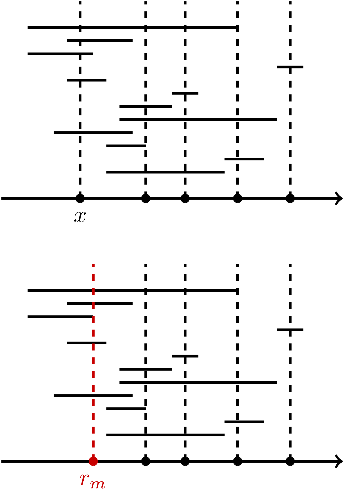
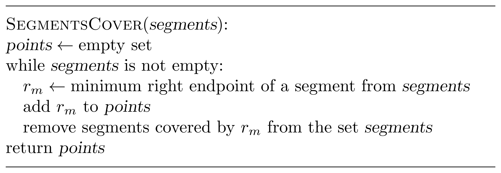

### Solution

Consider the smallest ending point of a segment: 
$r_m=\min\lbrace r_1, \dotsc, r_n\rbrace $. We claim that there exists an optimum 
solution containing the point $r_m$. To prove this, take an optimum solution $S$.
It must cover the
segment $[l_m,r_m]$, hence $S$ contains a point $x$ such 
that $l_m \le x \le r_m$. If $x=r_m$, then we are done. 
Otherwise, $x<r_m$. In this case,
we can replace $x$ by $r_m$ in $S$.

Clearly, this does not change the size of the solution $S$. 
To show that $S$ is still a solution, assume, 
for the sake of contradiction, that some segment 
$[l_i,r_i]$ is covered by $x$
but is not covered by $r_m$. This means that
\[l_i \le x \le r_i < r_m  ,\]
contradicting to the fact that $r_m$ is the smallest right end.

This way,
we arrive at the following algorithm:
add to a solution the minimum right end $r_m$,
discard all segments that are covered by $r_m$,
and iterate.

The picture below shows an example.

The running time is $O(n^2)$, where $n=|{segments}|$, 
since there are at most $n$ iterations of the {\tt while} loop 
(at least one segment is discarded at each iteration) and each iteration 
boils down to two scans of the list ${segments}$ 
(one scan to find the value of $r$ and another one to remove 
segments that are covered by $r$).

This algorithm is already sufficiently fast to pass the grader. 
To reduce the running time from $O(n^2)$ to $O(n\log n)$, 
you can simply sort segments in increasing order of their right 
endpoints and scan the resulting list just once.
