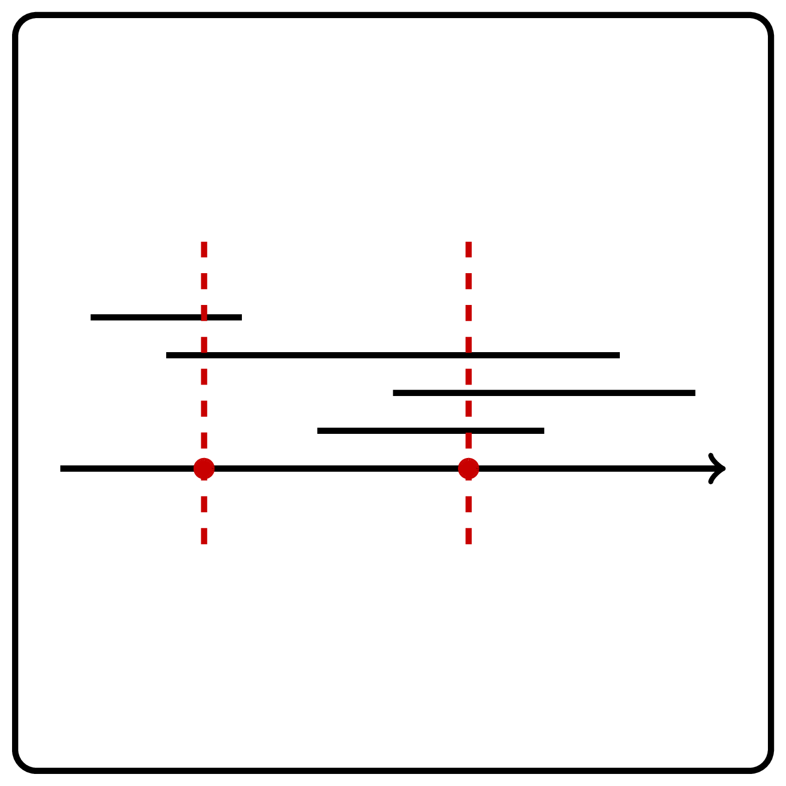

<%css "/util/common.css" %>

# Collecting Signatures

You are responsible for collecting signatures from all tenants in 
a building. For each tenant, you know the period of time when they 
are at home. You would like to collect all signatures by visiting the 
building as few times as possible. For simplicity, we assume that when 
you enter the building, you instantly collect the signatures of all 
the tenants who are in the building at that time.

Let's draw a diagram where each tenant will be represented as a segment
of time period when they are available. Now we need to solve the following
problem: find the minimum number of points needed to cover all the given segments
on a line.

Try our <a href="https://discrete-math-puzzles.github.io/puzzles/touch-all-segments/index.html">interactive puzzle</a> 
before solving this programming challenge!

    

### Input

The input of your function is a list $n$ of segments with borders
$l_i$ and $r_i$.

### Output

Your function should return the list of points that cover all 
given segments. The size of that list should be the minimal possible.
If there are multiple solutions, return any of them.

### Constraints

$1 \le n \le 100$; $0 \le l_i \le r_i \le 10^9$ for all $i$.

| Input                              | Return value |
|------------------------------------|--------------|
| `[(1, 3), (2, 5), (3, 6)]`         | `[3]`        |
| `[(4, 7), (1, 3), (2, 5), (5, 6)]` | `[3, 6]`     |

<%include "solution.md" %>

