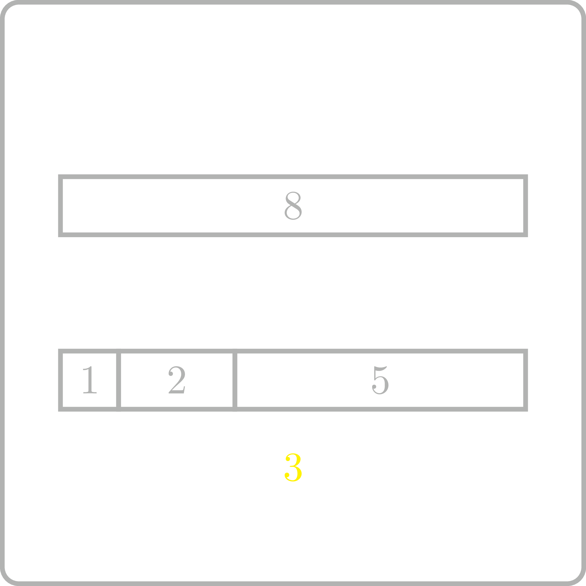

<%css "/util/common.css" %>

# Distinct Summands

    

Represent a positive integer as the sum of the
maximum number of pairwise distinct positive integers.

| Input | Return value |
|-------|--------------|
| 8     | 1 2 5        |
| 6     | 1 2 3        |
| 2     | 2            |

    Can one represent $8$ as the sum of four positive distinct integers?

    <%include "solution.md" %>

