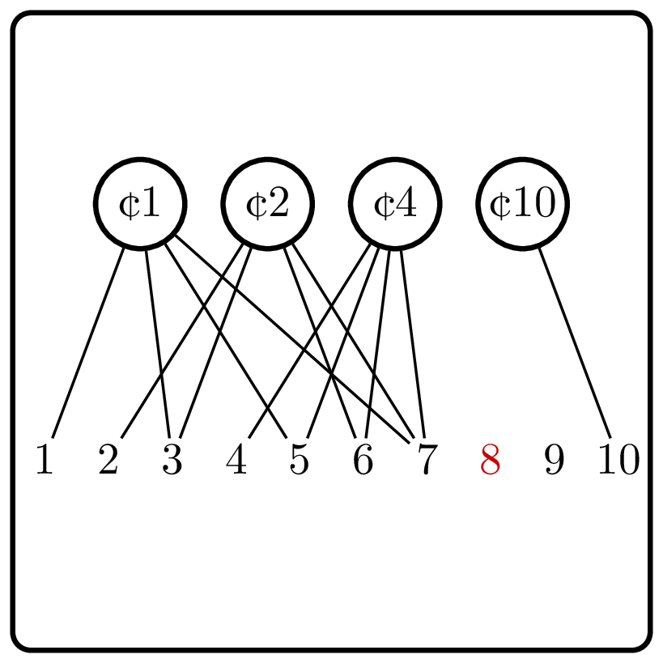

<%css "/util/common.css" %>

# Minimum Unchangeable Amount

    

Given $n$ coins of denominations $c_1 \le c_2 \le \dotsb \le c_n$,
find the minimum amount that cannot be changed using these coins.

| Input           | Return value |
|-----------------|--------------|
| `[1, 2, 4, 10]` | 8            |
| `[1, 1]`        | 3            |
| `[1, 2, 10]`    | 4            |

What can you say about $c_1$ if the smallest unchangeable amount is $1$?

What can you say about $c_1, c_2$ if the smallest unchangeable amount is $2$?

<%include "solution.md" %>

