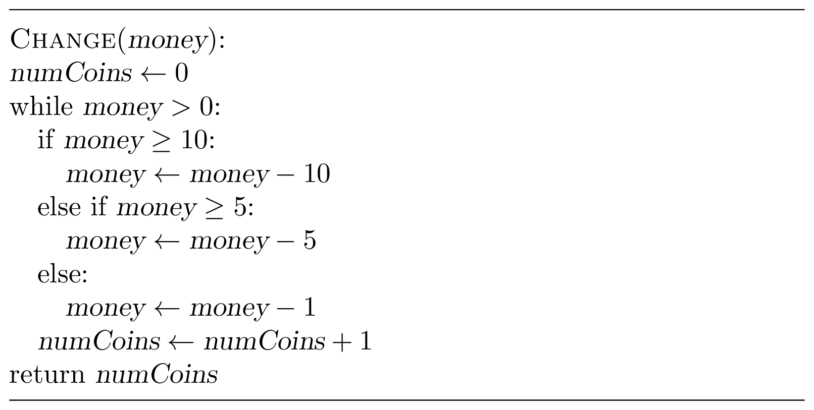

### Solution

Here is the idea: while ${money}>0$, keep taking a coin with the largest denomination that does not exceed 
${money}$, subtracting its value from ${money}$, and adding $1$ to 
the count of the number of coins:

There is also a one-liner for solving this problem:

Designing greedy algorithms is easy, but proving that they work is 
often non-trivial! You are probably wondering why we should waste time 
proving the correctness of the obvious ${Change}$ algorithm.
Just wait until we set up an algorithmic  trap to convince you that 
the proof below is not a waste of time!

To prove that this greedy algorithms is correct, we show that taking a coin
with the largest denomination is consistent with some optimal solution.
I.e., we need to prove that for any positive integer ${money}$, there
exists an optimal way of changing ${money}$ that uses at least one coin
with the denomination $D$, where $D$ is the largest number among $1,5,10$
that does not exceed ${money}$. We prove this by considering a few
cases. In each of the cases, we take some solution (i.e., a particular
change for ${money}$) and transform it so 	that the number of coins does
not increase and it contains at least one coin with denomination $D$. In
particular, if we start from an *optimal* way
to change ${money}$,
what we get is also an *optimal* way of changing ${money}$ that
contains a coin $D$.

1. $1 \le {money} < 5$. In this case, $D=1$ and the only way to 
change ${money}$ is to use ${money}$ coins of denomination 1.
2. $5 \le {money} < 10$. In this case, $D=5$. Clearly, any 
change of $money$ uses only coins with denominations 1 and 5. 
If it does not use a coin with denomination 5, then it uses at 
least five coins of denomination 1 (since ${money} \ge 5$). 
By replacing them with one coin of denomination 5, we improve this solution.
3. $10 \le {money}$. In this case, $D=10$. Consider a 
way of changing ${money}$ and assume that it does not use a coin 10. 
A simple but crucial observation is that some subset of the used 
coins sums up to 10. This can be shown by considering the number of 
coins of denomination 5 in this solution: if there are no 5's, 
then there are at least ten 1's, and we replace them with a single 10; 
if there is exactly one 5, then there are at least five 1's, and we 
replace them with a single 10 again; if there are at least two 5's, 
they can be again replaced.

Although this proof is long and rather boring, you need a proof
each time you come up with a greedy algorithm! The next exercise
hints a more compact way of proving the correctness of the algorithm above.

**Exercise break.** Show that ${money} \bmod 5$ coins of 
denomination 1 are needed in any solution and that the rest 
should be changed with coins of denomination 10 and at most 
one coin of denomination 5.

#### Running Time
The running time of the ${Change}$ algorithm is $O({money})$, 
while its single line version requires only a few arithmetic operations.
