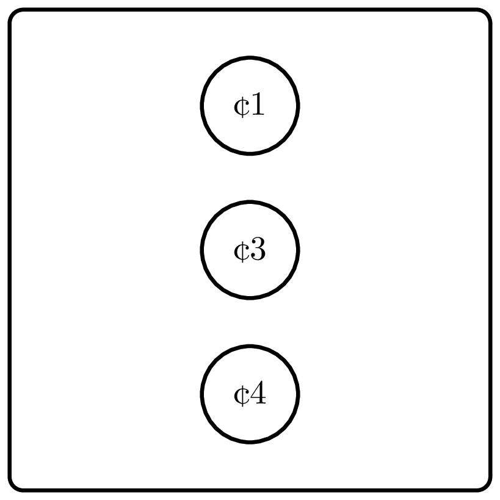

<%css "/util/common.css" %>

# Money Change

In this problem, you will implement a simple greedy algorithm used by 
cashiers all over the world. We assume that the cashier has an unlimited 
number of coins of each denomination.

    

Compute the minimum number of coins needed to change
the given value into coins with denominations 1, 5, and 10.

### Input

An `Int` ${money}$ — the value to change ($0 \le {money} \le 10^3$).

### Output

Return an `Int` representing the minimum number of coins.

| Input | Return value |
|-------|--------------|
| `2`   | `2`          |
| `28`  | `6`          |

<%include "solution.md" %>

