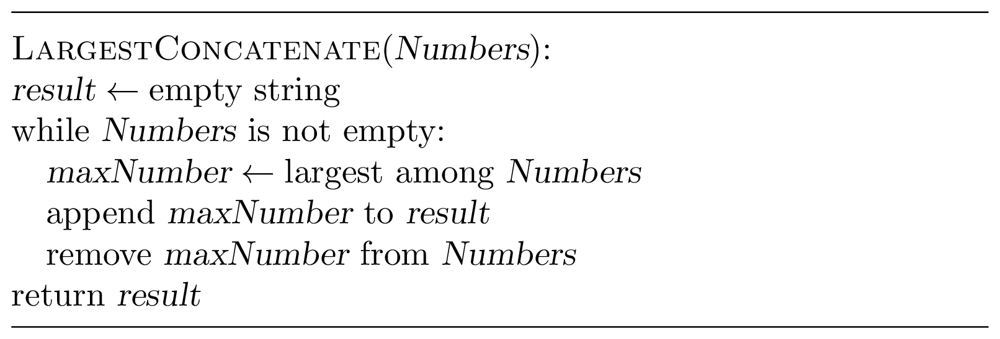
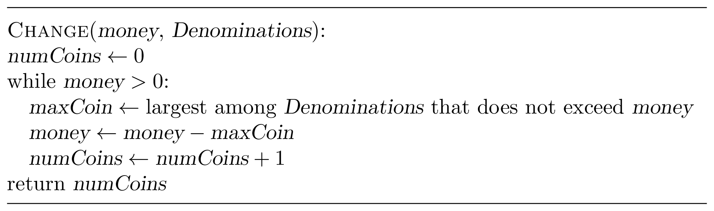
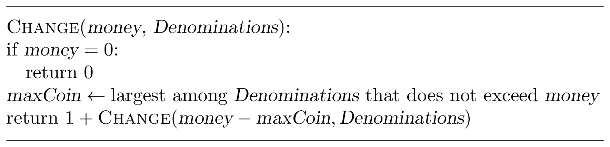

<%css "/util/common.css" %>

In this chapter, you will learn about seemingly naive yet powerful 
greedy algorithms. After learning the key idea behind greedy algorithms, 
some students feel that they represent an algorithmic Swiss Army knife 
that can be applied to solve nearly all programming challenges in this course. 
Be warned: since this intuitive idea rarely works in practice, you need to 
prove that your greedy algorithm does produce an optimal solution!

# The Main Idea

## Examples

A greedy algorithm builds a solution piece by piece and at each step, 
chooses the most profitable piece. It is best illustrated with examples.

Our first example is the Largest Concatenate Problem: 
given a sequence of single-digit numbers, find the largest number that can 
be obtained by concatenating these numbers. For example, for the input 
sequence (2,3,9,1,2), the output is the number 93221. 
It is easy to come up with an algorithm for this problem. 
Clearly, the largest single-digit number should be selected as the 
first digit of the concatenate. Afterward, we face essentially the 
same problem: concatenate the remaining numbers to get as large number 
as possible.

Our second example is the Money Change Problem: given a non-negative 
integer $money$, find the minimum number of coins with denominations 
$1$, $5$, and $10$ that changes $money$. For example, the minimum number of 
coins needed to change $money = 28$ is $6$: $28 = 10+10+5+1+1+1$. 
This representation of $28$ already suggests an algorithm. 
We take a coin $c$ with the largest denomination that does not exceed $money$. 
Afterward, we face essentially the same problem: change $(money − c)$ 
with the minimum number of coins.

**Stop and think!** What does ${LargestConcatenate}([2, 21])$ return?

**Stop and think!** What does ${Change}(8, [1, 4, 6])$ return?

If you use the same greedy strategy, 
then ${LargestConcatenate}([2, 21])$ returns $212$ and 
${Change}(8, [1, 4, 6])$ returns $3$ because $8 = 6 + 1 + 1$. 
But this strategy fails because the correct solutions are $221$ 
(concatenating $2$ with $21$) and $2$ because $8 = 4 + 4$!
Thus, in *rare* cases when a greedy strategy works, one should 
be able to prove its correctness: a priori, there should be no 
reason why a sequence of *locally* optimal moves leads to a *global* optimum!

## Proving Correctness of Greedy Algorithms

At each step, a greedy algorithm restricts the search space by 
selecting a most “profitable” piece of a solution. For example, 
instead of considering all possible concatenations, the 
${LargestConcatenate}$ algorithm only considers concatenations 
starting from the largest digit. Instead of all possible ways of 
changing money, the ${Change}$ algorithm considers only the ones that 
include a coin with the largest denomination (that does not exceed $money$). 
What one needs to prove is that this restricted search space still 
contains at least one optimal solution. This is usually done as follows.

<blockquote>
Consider an arbitrary optimal solution. If it belongs to the restricted 
search space, then we are done. If it does not belong to the 
restricted search space, tweak it so that it is still optimum and 
belongs to the restricted search space.
</blockquote>

Here, we will prove the correctness of ${LargestConcatenate}$ 
for single digit numbers (the correctness of ${Change}$ for 
denominations $1$, $5$, and $10$ will be given 
later).
Let $N$ be the largest number that can be obtained by concatenating 
digits $d_1, \dotsc, d_n$ in some order, and let $d_m$ be the largest digit. 
Then, $N$ starts with $d_m$. Indeed, assume that $N$ starts with some 
other digit $d_i < d_m$. Then $N$ has the form 
$d_i\alpha d_m \beta$, where $\alpha, \beta$ are (possibly empty) 
sequences of digits. But if we swap $d_i$ and $d_m$, we get a larger number!

**Stop and think!** What part of this proof breaks for
multi-digit numbers?

## Implementation
A greedy solution chooses the most profitable move and then continues to 
solve the remaining problem, which usually has the same type as the initial 
one. There are two natural implementations
of this strategy: either iterative with a while loop or recursive. 
Iterative solutions for the Largest Concatenate and Money Change problems 
are given above. Below are their recursive variants.

