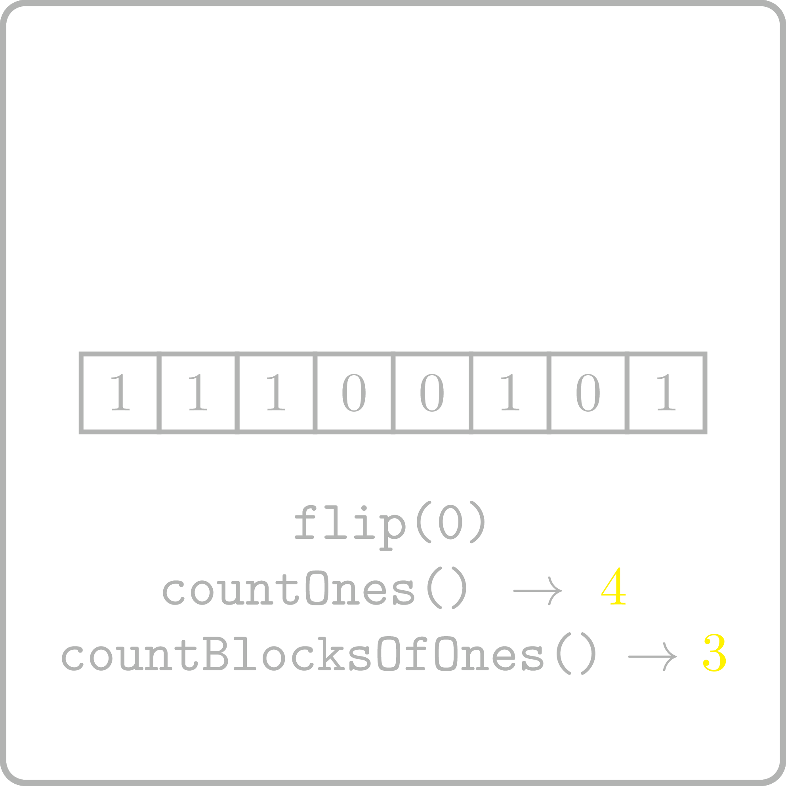

<%css "/util/common.css" %>

# Count Blocks of Ones with Updates

<div class="logo">
    
</div>

Implement a class that supports the following three operations
for a given binary string: 
   1. get the number of 1's in the string,
   2. get the number of blocks of 1's in the string,
   3. flip a given bit of the string.


```Kotlin
class CountBlocksOfOnesWithUpdates {
    fun countOnes(): Int
    fun countBlocksOfOnes(): Int
    fun flip(index: Int)
}
```

### Example

<div class="sample">

| Input                                    | Returns                                                                             |
|------------------------------------------|-------------------------------------------------------------------------------------|
| `CountBlocksOfOnesWithUpdates("001001")` | [CountBlocksOfOnesWithUpdates](psi_element://CountBlocksOfOnesWithUpdates) instance |
| `countOnes()`                            | 2                                                                                   |
| `countBlocksOfOnes()`                    | 2                                                                                   |
| `flip(3)`                                |                                                                                     |
| `countOnes()`                            | 3                                                                                   |
| `countBlocksOfOnes()`                    | 2                                                                                   |
| `flip(4)`                                |                                                                                     |
| `countOnes()`                            | 4                                                                                   |
| `countBlocksOfOnes()`                    | 1                                                                                   |

</div>

<div class="Hint">
When the $i$-bit is flipped, what indices can become or stop being
a starting index of a block?
</div>

<div class="hint">
<%include "solution.md" %>
</div>
