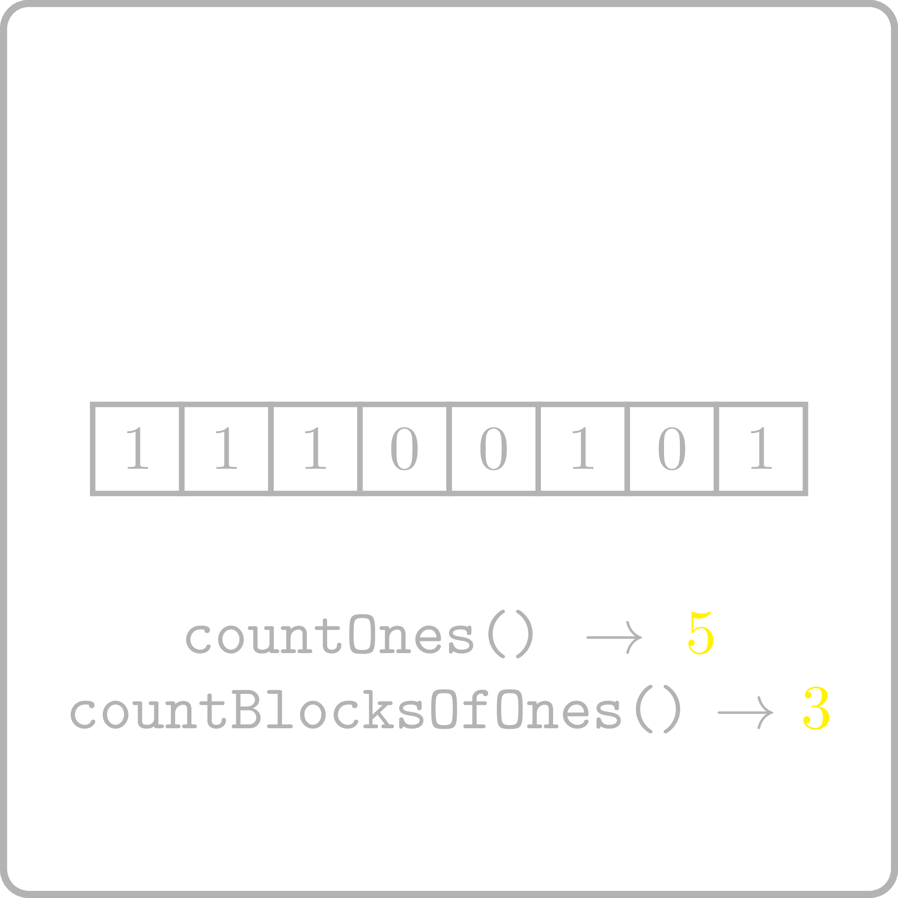

<%css "/util/common.css" %>

# Count Blocks of Ones

<div class="logo">
    
</div>

Implement a function that computes the number of blocks of 1's in the binary string.

```Kotlin
fun countBlocksOfOnes(s: CharSequence): Int
```

### Input

Given a `CharSequence` $s$ — the binary string consisting of `0`s and `1`s. The length doesn't exceed $10^6$.

### Output

Return an `Int` representing the number of blocks in the binary string.

### Examples

<div class="samples">

| Input         | Returns |
|---------------|---------|
| `"001001"`    | 2       |
| `"11100101"`  | 3       |

</div>

<div class="Hint">
Given an index $0 \le i < n$, how would you check whether it is a starting
index of a block of ones in a binary string $s[0\dotsc n)$?
</div>

<div class="hint">
<%include "solution.md" %>
</div>
