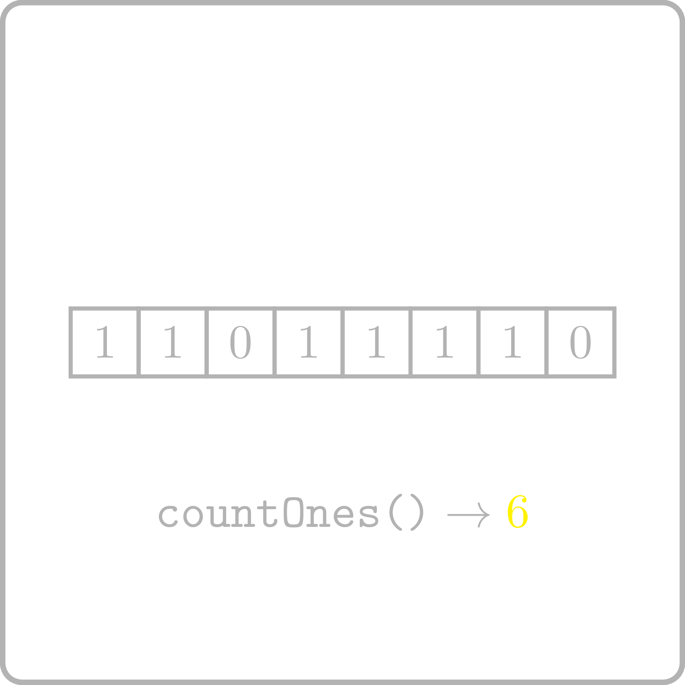

<%css "/util/common.css" %>

# Count Ones
<div class="logo">
    
</div>

Implement a function that allows one to get the number of
1's in a given binary string.

```Kotlin
fun countOnes(seq: CharSequence): Int
```


### Examples

<div class="samples">

| Input        | Returns |
|--------------|---------|
| `"001001"`   | 2       |
| `"11100101"` | 5       |

</div>

<div class="hint">
A linear scan of the string is sufficient.
</div>

<div class="hint">
<%include "solution.md" %>
</div>