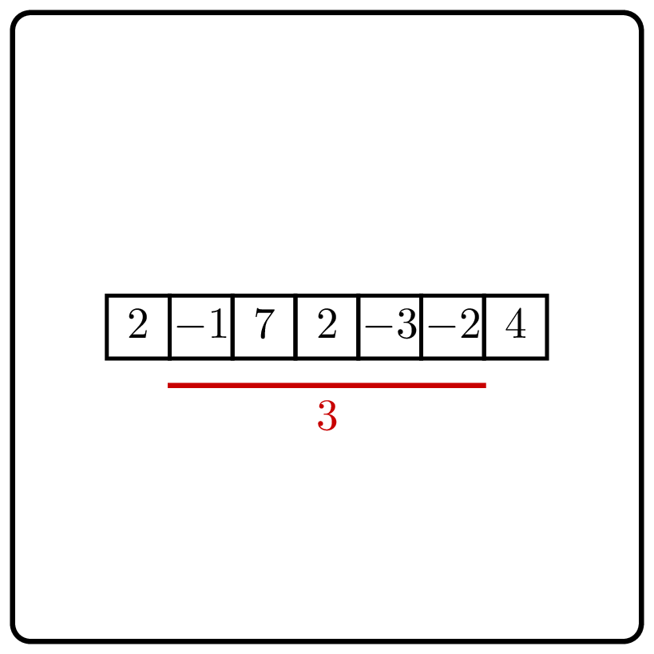

<%css "/util/common.css" %>

# Range Sum Queries
<div class="logo">
    
</div>

Implement a class that allows one to compute
the sum of any subrange of a given integer sequence.

For an integer sequence $a_0, \dotsc, a_{n-1}$ and indices 
$0 \le l \le r \le n$, by $\operatorname{query}(l,r)$
denote the sum $\sum_{l \le i <r}a_i=a_l+a_{l+1}+\dotsb+a_{r-1}$.

```Kotlin
class RangeSum {
    fun getSum(left: Int, right: Int): Long
}
```

As a range may be as long as $n$, answering a single range sum query 
may require about $n$ additions. Hence, answering $q$ range sum queries
naively may result in $nq$ arithmetic operations. If, say, $n=q=10^6$, 
this would not fit into one second for sure.
Your goal is to design a faster algorithm.

### Input

An `IntArray` of size not exceeding $10^7$.

### Output

- the `createRSQInstance` function should return
an instance of class implementing the [RangeSumQueries](psi_element://RangeSumQueries) interface.
- `getSum(l, r)` should return the value of $\operatorname{query}(l, r)$

### Example

<div class="sample">

| Input                        | Returns                                     |
|------------------------------|---------------------------------------------|
| `RangeSum([1, 3, -2, 4, 2])` | [RangeSum](psi_element://RangeSum) instance |
| `getSum(0, 1)`               | `1`                                         |
| `getSum(0, 5)`               | `8`                                         |
| `getSum(2, 2)`               | `0`                                         |
| `getSum(2, 3)`               | `-2`                                        |
| `getSum(2, 5)`               | `4`                                         |
| `getSum(1, 4)`               | `5`                                         |
| `getSum(0, 0)`               | `0`                                         |
| `getSum(4, 5)`               | `2`                                         |

</div>


<div class="hint">
Assume that you know the value of all prefix sums, that is,
$\operatorname{range}(0,k)$ 
for all $0 \le k \le n$.
Using these values, can you compute the value of 
$\operatorname{range}(l,r)$ in constant time, 
for any $0 \le l \le r \le n$?
</div>

<div class="hint">
Computing $\operatorname{range}(0,k)$ for all $0 \le k \le n$ naively 
takes time $0+1+2+\dotsb+n=\frac{n(n+1)}{2}$. 
Already for $n=10^6$, that would be too slow.
Can you compute all prefix sums faster?
</div>

<div class="hint">
<%include "solution.md" %>
</div>

