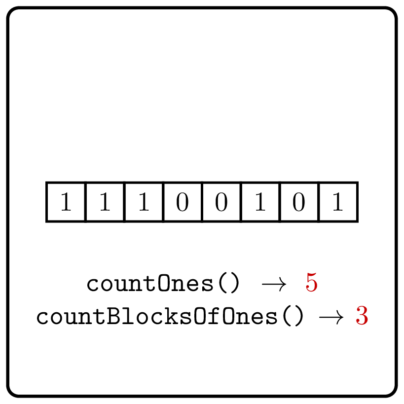

<%css "/util/common.css" %>

# Count Blocks of Ones

<div class="logo">
    
</div>

Implement an interface that supports the following two operations
for a given binary string: get the number of 1's in the string
and get the number of blocks of 1's in the string.

```Kotlin
interface CountBlocksOfOnes {
    fun countOnes(): Int
    fun countBlocksOfOnes(): Int
}
```

### Example 1

<div class="sample">

| Input                      | Returns                                                       |
|----------------------------|---------------------------------------------------------------|
| `createInstance("001001")` | [CountBlocksOfOnes](psi_element://CountBlocksOfOnes) instance |
| `countOnes()`              | 2                                                             |
| `countBlocksOfOnes()`      | 2                                                             |

</div>

### Example 2

<div class="sample">

| Input                        | Returns                                                       |
|------------------------------|---------------------------------------------------------------|
| `createInstance("11100101")` | [CountBlocksOfOnes](psi_element://CountBlocksOfOnes) instance |
| `countOnes()`                | 5                                                             |
| `countBlocksOfOnes()`        | 3                                                             |

</div>

<div class="Hint">
Given an index $0 \le i < n$, how would you check whether it is a starting
index of a block of ones in a binary string $s[0\dotsc n)$?
</div>

<div class="hint">
<%include "solution.md" %>
</div>
