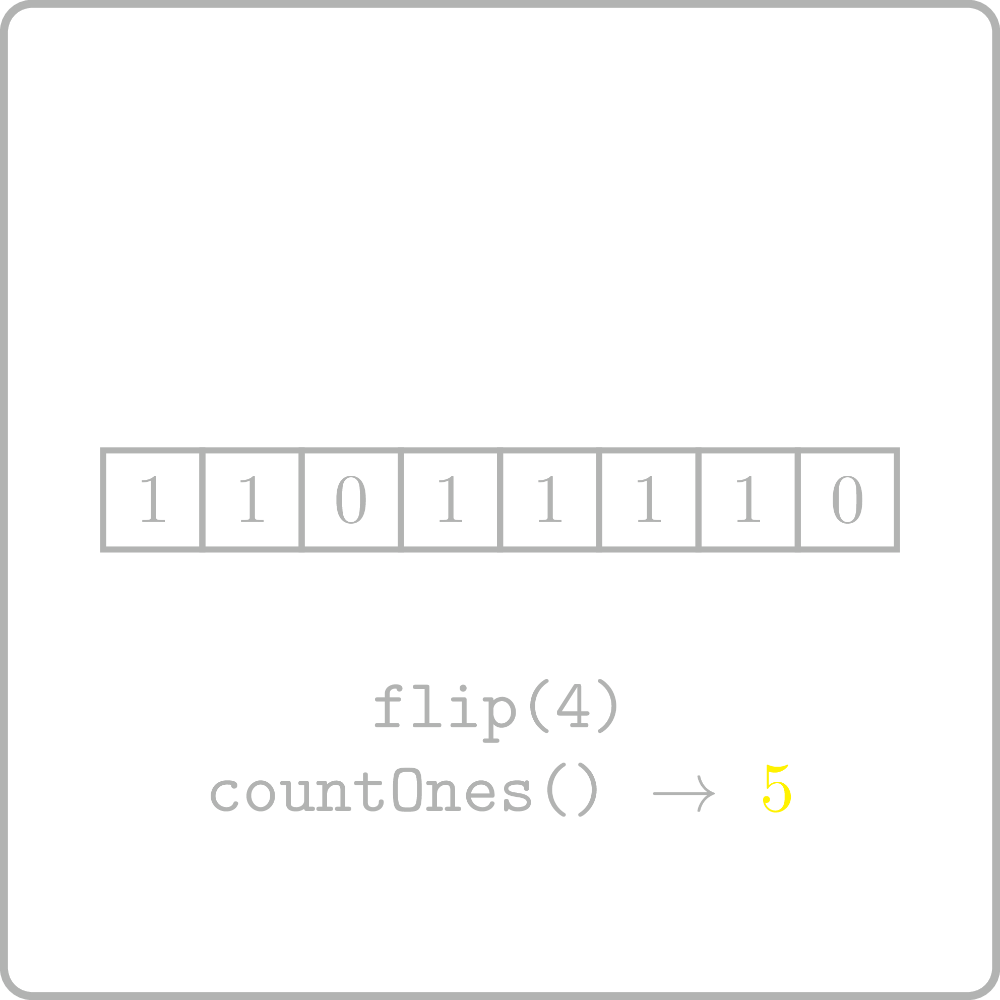

<%css "/util/common.css" %>

# Count Ones with Updates
<div class="logo">
    
</div>

Implement an interface that supports the following two operations
for the given binary string: get the number of 1's in the string
and flip a given bit of the string.

```Kotlin
interface CountOnesWithUpdates {
    fun countOnes(): Int
    fun flip(index: Int)
}
```

### Example 1

<div class="sample">

| Input                      | Returns                                                             |
|----------------------------|---------------------------------------------------------------------|
| `createInstance("001001")` | [CountOnesWithUpdates](psi_element://CountOnesWithUpdates) instance |
| `countOnes()`              | 2                                                                   |
| `flip(0)`                  |                                                                     |
| `countOnes()`              | 3                                                                   |
| `flip(1)`                  |                                                                     |
| `countOnes()`              | 4                                                                   |
| `flip(2)`                  |                                                                     |
| `countOnes()`              | 3                                                                   |

</div>

<div class="hint">
How could you avoid 
counting the number of ones from scratch 
each time `countOnes` is called?
</div>

<div class="hint">
<%include "solution.md" %>
</div>