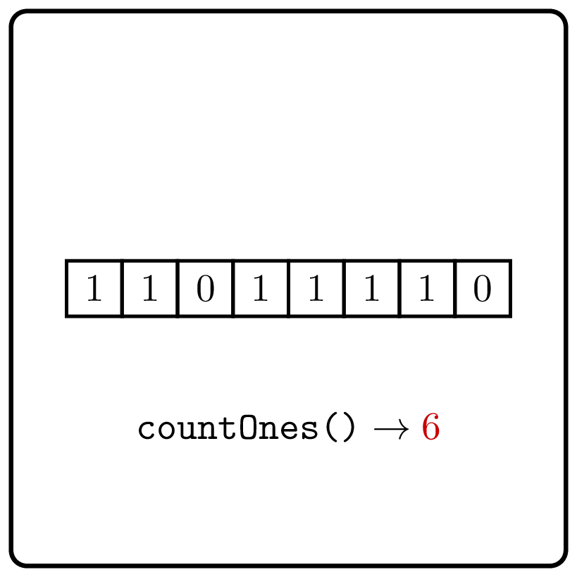

<%css "/util/common.css" %>

# Count Ones
<div class="logo">
    
</div>

Implement an interface that allows one to get the number of
1's in the given binary string.

```Kotlin
interface CountOnes {
    fun countOnes(): Int
}
```


### Example 1

<div class="sample">

| Input                      | Returns                                       |
|----------------------------|-----------------------------------------------|
| `createInstance("001001")` | [CountOnes](psi_element://CountOnes) instance |
| `countOnes()`              | 2                                             |

</div>

### Example 2

<div class="sample">

| Input                        | Returns                                       |
|------------------------------|-----------------------------------------------|
| `createInstance("11100101")` | [CountOnes](psi_element://CountOnes) instance |
| `countOnes()`                | 5                                             |

</div>
