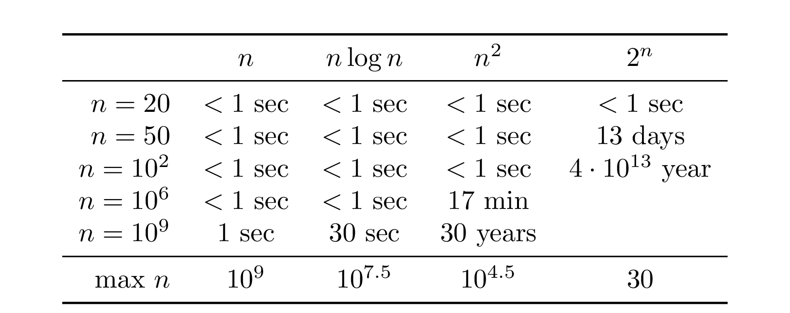
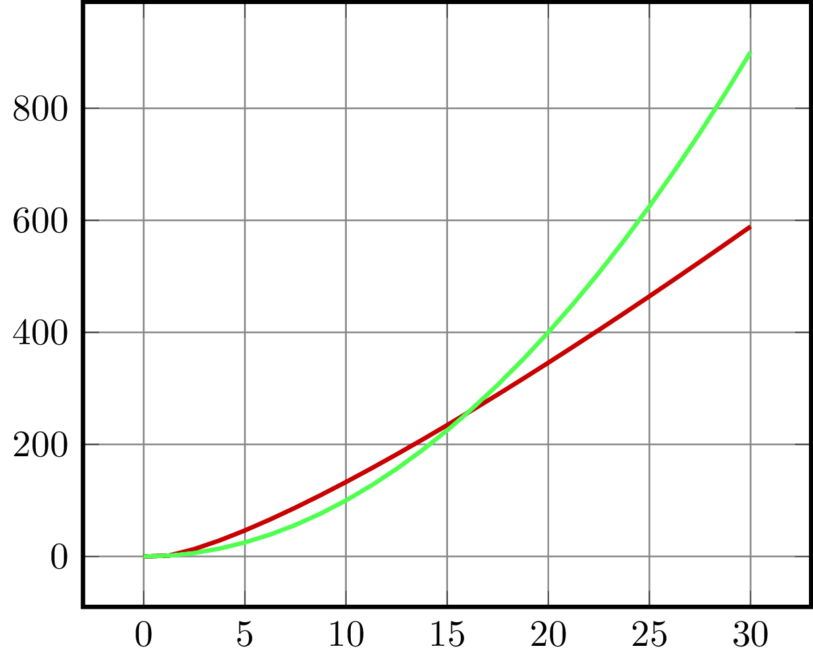
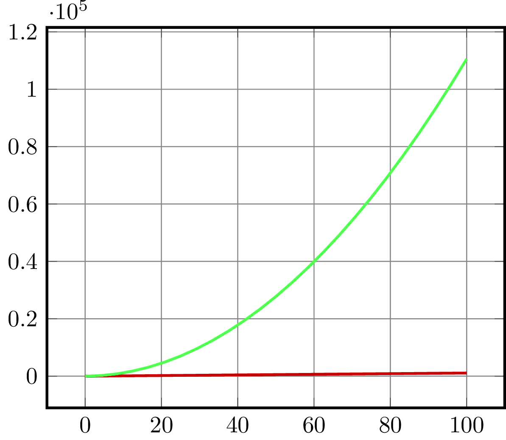

## Frequently Arising Running Times

The table below shows the approximate running time of four
algorithms with running time $n$, $n\log n$, $n^2$, and $2^n$ 
on various input sizes
for a hypothetical computer that performs $10^9$ operations per second.
The last row shows the maximum value of $n$ for which the running 
time of the corresponding
algorithm fits into one second.

## Estimating the Running Time: Practice

The source code on the left 
implements the following three functions, each taking
an integer array `a` of size $n$ as an input.
 * The function `linear` computes the number of positive elements in `a` by
a single scan. It performs about $n$ basic operations.
 * The function `quadratic` computes the number of pairs $0 \le i < j < n$
such that $a[i]+a[j]>0$ using two nested `for` loops. It performs
about $n^2$ basic operations.
 * The function `exponential` computes the number of subsets of the
elements of `a` whose sum is equal to zero. It performs about $2^n$
basic operations.

The function `main` shows how to measure the running time
of a particular call.
Play around with various values of $n$ to see how the running time
of all three methods changes.

## Estimating the Running Time: Theory

To figure out how long a program would take to run on a real computer, 
we would need to know things like: the speed of the computer, the system architecture, 
the compiler being used, details of the memory hierarchy, etc.
Hence, carefully estimating the running time is a rather difficult task.
Moreover, in practice, you might not even know some of these details.
That is why computer scientists use the *big-$O$* notation to estimate the running time 
of an algorithm without knowing anything about all these details!

If we say that the running time of an algorithm is quadratic, or $O(n^2)$, 
it means that the running time of the algorithm on an input of size $n$ is limited by a quadratic function of $n$. 
That limit may be $99.7n^2$, or $0.001n^2$, or $5n^2+3.2n+99993$; the main factor that describes the growth 
rate of the running time is the term that grows the fastest with respect to $n$, for example $n^2$  when compared 
to terms like $3.2n$ or $99993$. All functions with a leading term of $n^2$  have more or less the same rate of 
growth, so we lump them into one class, which we call $O(n^2)$. The difference in behavior between two quadratic 
functions in that class, say $99.7n^2$  and $5n^2 + 3.2n + 99993$, is negligible when compared to the difference in 
behavior between two functions in different classes, say $5n^2 + 3.2n$  and $1.2n^3$. Of course, $99.7n^2$ 
and $5n^2$  are different functions and we would prefer an algorithm that takes $5n^2$ operations to an algorithm 
that takes $99.7n^2$. However, computer scientists typically ignore the leading constant and pay attention only to the 
fastest growing term.

When we write $f(n) = O(n^2)$, we mean that the function $f(n)$  does not grow faster than a function with 
a leading term of $cn^2$, for a suitable choice of the constant $c$. In keeping with the healthy dose of 
pessimism toward an algorithm's performance, we measure
an algorithm's efficiency as its worst case  efficiency, which is the largest amount of time an algorithm 
can take given the worst possible input of a given size. The advantage to considering the worst case 
efficiency of an algorithm is that we are guaranteed that our algorithm will never behave worse than our 
worst case estimate, so we are never surprised or disappointed. Thus, when we derive a big-$O$ bound, 
it is a bound on the worst case efficiency.

Consider two algorithms and denote by $f(n)$ and $g(n)$ their running times on an input of size $n$.
We say that *$f$ grows no faster than $g$*
if there exists a constant $c$ such that for every positive integer $n$,
$f(n) \le c \cdot g(n)$ (equivalently, $\frac{f(n)}{g(n)} \le c$ for all $n$).
In this case, we write $f=O(g)$ or $f \preceq g$. The notation $f=O(g)$
is the standard one, whereas some learners find the notation $f \preceq g$ to be more intuitive.

To give an example, let's visualize the functions
$f(n)=4n\log_2n$ and $g(n)=n^2$
by plotting them for $1 \le n \le 30$.

As the picture reveals, $4n\log_2n \ge n^2$ for $n \le 16$,
but then the two functions switch. Indeed, $4\log_2n \le n$ for $n \ge 16$.
If we set $c=16$, then
$$4n\log_2n \le cn^2 \text{ for all $n \ge 1$.}$$
We conclude that $4n\log_2n=O(n^2)$.

Now, let $f(n)=2n^2+5n+3$ and $g(n)=n^2$.
On the one hand, $f(n)$ is larger than $g(n)$ for all positive $n$. On the other hand,
$$f(n)=2n^2 + 5n + 3 \le 2n^2+5n^2+3n^2=10n^2=10g(n)$$ for all positive integers $n$.
That is, $f(n)$ is at most ten times larger than $g(n)$.
We conclude that $f$ grows no faster than $g$ (and write $f=O(g)$ or $f \preceq g$).

Now, let us compare $f(n)=11n$ and $g(n)=2n^2+5n+3$. First, let us look at their plots.

This plot reveals that both functions grow (as $n$ grows) but $11n$ grows "slower". This can be formally stated
as follows.

For two functions $f$ and $g$, we say that *$f$ grows slower than $g$* and write $f=o(g)$ or $f \prec g$ if the fraction $\frac{f(n)}{g(n)}$ goes to zero as $n$ grows.

Of course, if $f \prec g$ (equivalently, $f=o(g)$), then also $f \preceq g$ (equivalently, $f=O(g)$). In plain English: if $f$ grows slower than $g$, then certainly $f$ grows no faster than $g$.

### Advantages and Disadvantages

Using the big-$O$ notation to evaluate running times has several advantages:

* In many cases, computer scientists mainly care about how the running time grows with the input size — the big-$O$ notation clarifies the growth rate.
* The big-$O$ notation simplifies the formulas for the running time:
    - $O(n^2)$ vs. $3n^2+5n+2$.
    - $O(n)$ vs. $n+\log_2n+7$.
    - $O(n\log n)$ vs $4n\log_2n+5$. In particular, $\log_2n$, $\log_3n$, and $\log_an$ differ by constant multipliers, so we don't need to specify the base of the logarithm in the big-$O$ notation.
* With the big-$O$ notation, we no longer need to worry about things like how fast the computer is, or what the memory hierarchy looks like, or what compiler we used. Although these things have a big impact
  on the final running time, that impact will generally only be a constant
  multiple.

These advantages come with some disadvantages.
Indeed, the big-$O$ notation "loses" some information, since it ignores constant multipliers.
If you have two algorithms and one of them is a hundred times faster, they still have the same
estimate of the running time in the
big-$O$ notation.
But, in practice, if you want to make things fast, a factor of 100 is a big deal.

Nevertheless, the big-$O$ notation is very useful and we will use it throughout this book.

### Five Common Rules

Let us review the common rules of comparing the order
of growth of functions arising in algorithm analysis.

* Multiplicative constants can be omitted:
  $$c \cdot f \preceq f  .$$
  Examples: $5n^2 \preceq n^2$, $\frac{n^2}{3} \preceq n^2$, $7n \preceq n$.
* Out of two polynomials, the one with larger degree grows faster:
  $$n^a \prec n^b \text{ for } 0 \le a < b . $$
  Examples: $n \prec n^2$, $\sqrt{n} \prec n^{2/3}$, $n^2 \prec n^3$, $n^0 \prec \sqrt{n}$.
* Any polynomial grows slower than any exponential:
  $$n^a \prec b^n \text{ for } a \ge 0, b>1 . $$
  Examples: $n^3 \prec 2^n$, $n^{10} \prec 1.1^n$.
* Any polylogarithm (that is, a function of the form $(\log n)^a$) grows slower than any polynomial:
  $$(\log n)^a \prec n^b \text{ for } a, b>0  .$$
  Examples: $(\log n)^3 \prec \sqrt{n}$, $n\log n \prec n^2$.
* Smaller terms can be omitted:
  $$\text{if $f \preceq g$, then $f+g\preceq g$.}$$
  Examples: $n+n^2 \preceq n^2$, $n^9+2^n\preceq 2^n$.

