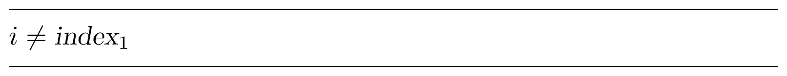

In this task, we'll fix the second issue in our initial solution
to the Maximum Pairwise Product problem. While doing this,
we will learn stress testing, an essential testing technique
for algorithmic solutions.

If you paste a solution from the previous task (that uses `Long` type)
to the [original problem](course://Warmup/Maximum Pairwise Product), you 
will see that it still fails in the grader. This time, the error message
is "Time Limit Exceeded".

TODO: replace $MaxPairwiseProductNaive$ with the name of the Kotlin method

$MaxPairwiseProductNaive$ performs of the order of
$n^2$ steps on a sequence of length $n$.
For the maximal possible value $n=2\cdot 10^5$,
the number of steps is of the order $4\cdot 10^{10}$.
Since many modern computers perform roughly $10^8$–$10^9$
basic operations per second (this depends on a machine, of course),
it may take tens of seconds to execute ${MaxPairwiseProductNaive}$,
exceeding the time limit for the Maximum Pairwise Product Problem.

We need a faster algorithm!

In search of a faster algorithm, you play with small examples like
$[5,6,2,7,4]$. Eureka—it suffices to multiply the two largest elements
of the array—7 and 6!

Since we need to find the largest and the second largest elements,
we need only two scans of the sequence. During the first scan, we find
the largest element. During the second scan, we find the largest element
among the remaining ones by skipping the element found at the previous 
scan. The corresponding code is shown on the left. Several unit tests are already implemented for this solution
in `test/tests.kt`.

TODO: Niyaz, please implement a buggy algorithm in task.kt

Surprisingly, this solution still fails in the grader with the 
"Failed test 5 out of 17: Wrong answer" message! But how would you generate a test case 
that make your program fail and help you to figure out what went wrong?

#### Can You Tell Me What Error Have I Made?

You are probably wondering why we did not provide you with the 5th out of 17 test datasets that brought down
your program. The reason is that nobody will provide you with the test cases in real life!

Since even experienced programmers often make subtle mistakes solving algorithmic problems, it is important to
learn how to catch bugs as early as possible. When the authors of this book started to program, they
naively thought that nearly all their programs are correct. By now, we know that our programs are
*almost never* correct when we first run them.

When you are confident that your program works, you often test it on just a few test cases,
and if the answers look reasonable, you consider your work done. However, this is a recipe for a disaster.
To make your program *always* work, you should test it on a set of carefully designed test cases.
Learning how to implement algorithms as well as test and debug your programs will be invaluable in your
future work as a programmer.

When your program fails on the 5th out of 17 datasets, we typically do not reveal this dataset.
However, we make an exception for all eight coding challenges in the "Algorithmic Warm Up"
section — when you go through this section, we provide you with one of the test cases that you failed to pass
to make it easier to debug your code.

#### Stress Testing

We will now introduce *stress testing*—a technique for generating thousands of tests with the goal of
finding a test case for which your solution fails.

A stress test consists of four parts:
1. Your implementation of an algorithm.
2. An alternative, trivial and slow, but correct implementation of an algorithm for the same problem.
3. A random test generator.
4. An infinite loop in which a new test is generated and fed into both implementations to compare the results.
5. If their results differ, the test and both answers are output, and the program stops, otherwise the loop repeats.

The idea behind stress testing is that two correct implementations
should give the same answer for each test (provided the answer to the problem is unique).
If, however, one of the implementations is incorrect, then there exists a test on which their answers differ.
The only case when it is not so is when there is the same mistake in both implementations, but that is unlikely
(unless the mistake is somewhere in the input/output routines which are common to both solutions).
Indeed, if one solution is correct and the other is wrong, then there exists a test case on which they differ.
If both are wrong, but the bugs are different, then most likely there exists a test on which two solutions give
different results.

Here is the stress test for $MaxPairwiseProductFast$
using $MaxPairwiseProductNaive$ as a trivial implementation:

TODO: Niyaz, replace this with a code in Kotlin and adjust the surrounding text accordingly


The while loop above starts with generating the length of the input sequence $n$,
a random number between $2$ and $N$. It is at least $2$, because the problem statement specifies that $n \ge 2$.
The parameter $N$ should be small enough to allow us to explore many tests despite the fact that one
of our solutions is slow.

After generating $n$, we generate an array $A$ with $n$ random numbers from $0$ to $M$ and output it so
that in the process of the infinite loop we always know what is the current test; this will make it easier to
catch an error in the test generation code. We then call two algorithms on $A$ and compare the results.
If the results are different, we print them and halt. Otherwise, we continue the while loop.

Let's run ${StressTest}(10, 100\,000)$ and keep our fingers crossed in a hope that it outputs "Wrong answer."
We see something like this (the result can be different on your computer because of a
different random number generator).

```
...
OK
67232 68874 69499
OK
6132 56210 45236 95361 68380 16906 80495 95298
OK
62180 1856 89047 14251 8362 34171 93584 87362 83341 8784
OK
21468 16859 82178 70496 82939 44491
OK
68165 87637 74297 2904 32873 86010 87637 66131 82858 82935
Wrong answer: 7680243769 7537658370
```

Hurrah! We've found a test case where $MaxPairwiseProductNaive$ and
$MaxPairwiseProductFast$ produce different results, so now we can check
what went wrong. Then we can debug this solution on this test case,
find a bug, fix it, and repeat the stress test again.

**Stop and Think!** Do you see anything suspicious in the found dataset?

Note that generating tests automatically and running stress test is easy,
but debugging is hard. Before diving into debugging, let's try to
generate a smaller test case to simplify it. To do that, we change
$N$ from 10 to 5 and $M$ from $100\,000$ to $9$.

**Stop and Think!** Why did we first run $StressTest$ with large parameters
$N$ and $M$ and now intend to run it with small $N$ and $M$?

We then run the stress test again and it produces the following.
```
...
7 3 6
OK
2 9 3 1 9
Wrong answer: 81 27
```

The slow $MaxPairwiseProductNaive$ gives the correct answer $81$ ($9 \cdot 9 = 81$),
but the fast $MaxPairwiseProductFast$ gives an incorrect answer $27$.

**Stop and Think!** How $MaxPairwiseProductFast$ can possibly return $27$?

To debug our fast solution, let's check which two numbers it identifies as two largest ones.
To do this, we add the following line before the return statement of the
$MaxPairwiseProductFast$ function:


After running the stress test again, we see the following.
```
...
7 3 6
1 3
OK
5
2 9 3 1 9
2 3
Wrong answer: 81 27
```

Note that our solutions worked and then failed on exactly the same test cases as on the previous run of the stress test,
because we didn't change anything in the test generator. The numbers it uses to generate tests
are pseudorandom rather than random—it means that the sequence looks random, but it is the same each time we run
this program. It is a convenient and important property, and you should try to have your programs exhibit such
behavior, because deterministic programs (that always give the same result for the same input) are easier to
debug than non-deterministic ones.

Now let's examine ${index}_1=2$ and ${index}_2=3$. If we look at the code for determining the
second maximum, we will notice a subtle bug. When we implemented a condition on $i$ (such that it is not the same as
the previous maximum) instead of comparing $i$ and ${index}_1$, we compared $A[i]$ with $A[index_1]$.
This ensures that the second maximum differs from the first maximum by the value rather than by the index of the
element that we select for solving the Maximum Pairwise Product Problem. So, our solution fails on any test case
where the largest number is equal to the second largest number. We now change the condition from

to

After running the stress test again, we see a barrage of ``OK'' messages on the screen.
We wait for a minute until we get bored and then decide that $MaxPairwiseProductFast$ is finally correct!

However, you shouldn't stop here, since you have only generated very small tests with $N=5$ and $M=10$.
We should check whether our program works for larger $n$ and larger elements of the array.
So, we change $N$ to $1\,000$ (for larger $N$, the naive solution will be pretty slow, because its running
time is quadratic). We also change $M$ to $200\,000$ and run. We again see the screen filling with words "OK",
wait for a minute, and then decide that (finally!) $MaxPairwiseProductFast$ is correct. Afterward, we submit the
resulting solution to the grading system and pass the Maximum Pairwise Product Problem test!

As you see, even for such a simple problem like Maximum Pairwise Product, it is easy to make subtle mistakes when
designing and implementing an algorithm. The pseudocode below presents a more "reliable" way of implementing the
algorithm.


