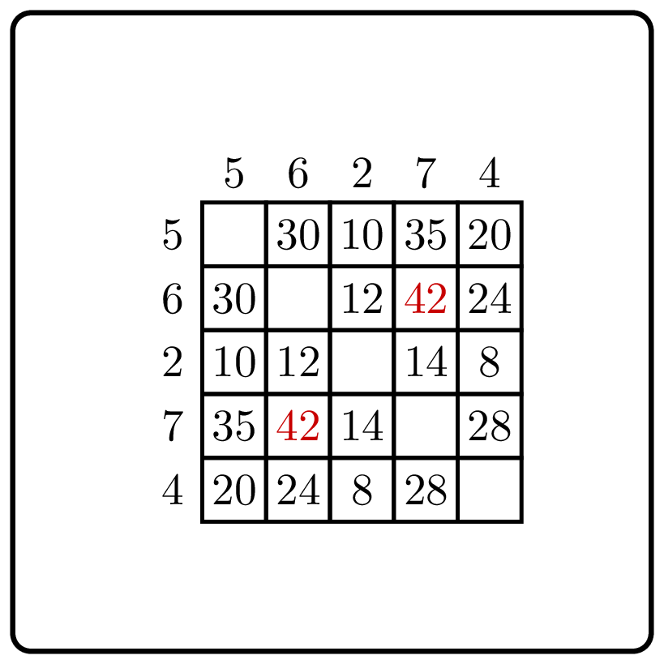

<%css "/util/common.css" %>

# Maximum Pairwise Product

    

Given a sequence of non-negative integers
$a_1, \dots, a_{n}$,
compute the maximum pairwise product, i.e., 
$$\max\limits_{1 \le i \neq j \le n}a_i \cdot a_j.$$
Note that $i$ and $j$ should be different, though it may be the case
that $a_i=a_j$.

Constraints: $2 \le n \le 100$; $0 \le a_1, \dots, a_{n} \le 100$.

### Example 1

| Input     | Returns |
|-----------|---------|
| `1, 2, 3` | `6`     |

### Example 2

| Input                            | Returns |
|----------------------------------|---------|
| `7, 5, 14, 2, 8, 8, 10, 1, 2, 3` | `140`   |

In the file
[Task.kt](course://Warmup/Maximum%20Pairwise%20Product/src/Task.kt), 
you see a straightforward solution to
this problem. To compute the maximum pairwise product,
it just goes through all possible pairs. 
In the file
[Tests.kt](course://Warmup/Maximum%20Pairwise%20Product/test/Tests.kt),
you will find unit tests for this problem.
Add a few more tests to this file and run them to ensure that 
everything works as expected. Then, press the "Check" button
from the right pane to submit this solution to the autograding system.
