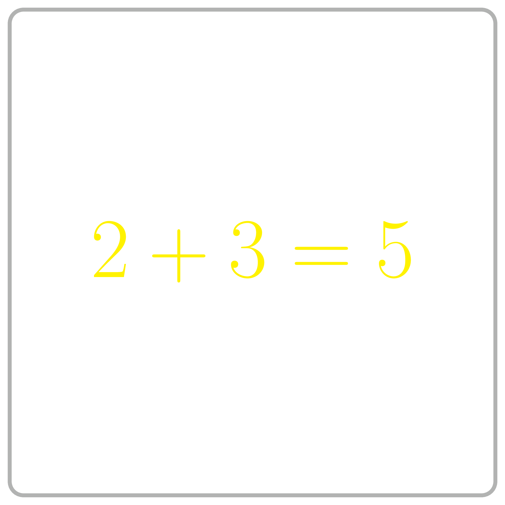

<%css "/util/common.css" %>

# Sum of Two Digits

    

Given two digits $0 \le a \le 9$ and $0 \le b \le 9$,
compute their sum.

### Example

| Input         | Returns |
|---------------|---------|
| `9, 7`        | `16`    |

We start from this ridiculously simple problem to show you the 
pipeline of reading the problem statement, designing an algorithm, 
implementing it, testing and debugging your program, and submitting 
it to the grading system.

<%include "solution.md" %>

